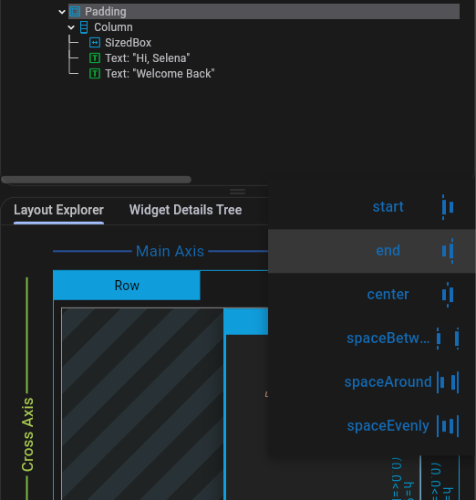

## Devtools_Widget_Inspector  

본 애플리케이션의 여러 위젯을 볼 수 있는 DevTool이다.  
매우매우매우 편리한 기능을 제공하므로 꼭 알고 있자.  

애플리케이션을 Debug 했을 때 만들어지는 플로팅 썸띵에 돋보기 모양이 바로 그것이다.  

  

이것을 눌러보면  

  

이 애플리케이션의 위젯들의 위치, 그리고 그 안에 있는 속성들에 대한 정보를 한 번에 볼 수 있다. 그리고 일부 속성은 수정해볼 수도 있다.  

  

### Select Widget Mode  

그리고 Select Widget Mode 라는 것도 있는데, 이것을 활성화 시키면 시뮬레이터 화면에서 요소들을 클릭함으로써 이에 대한 정보를 띄워줄 수도 있다.  

  

### Overlay Guidelines  

Overlay Guidelines 를 활성화시키면 모든 요소의 Guideline 을 보여준다.  

