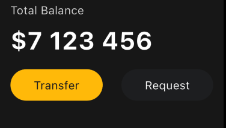
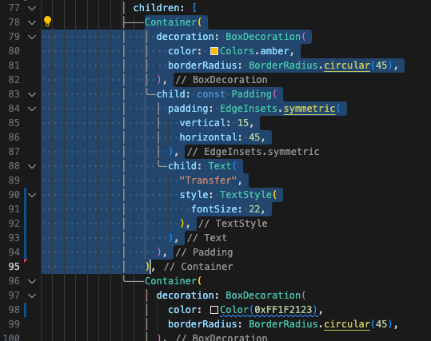
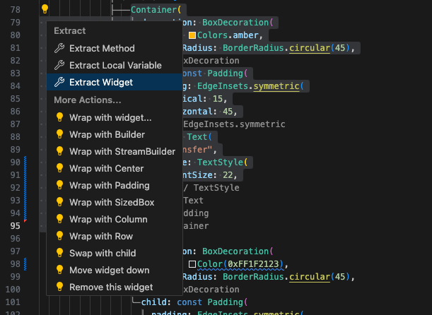
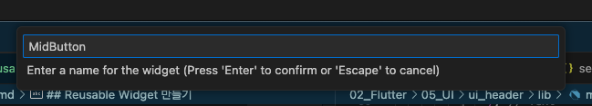
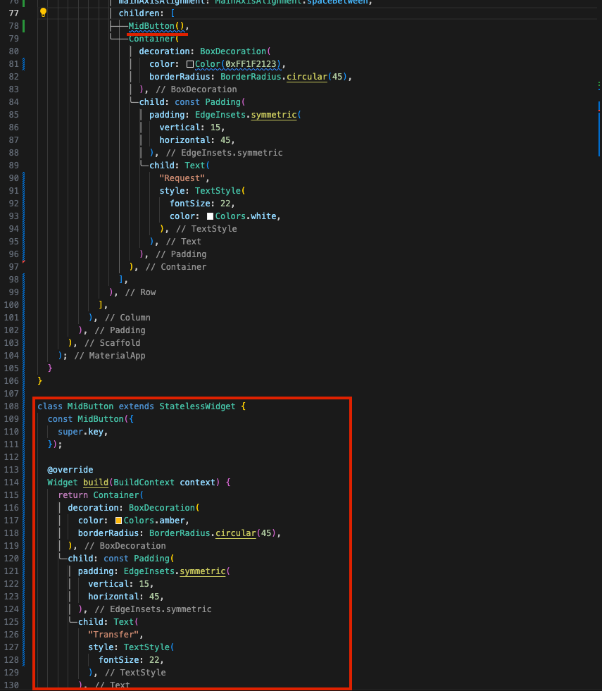
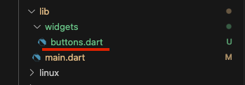
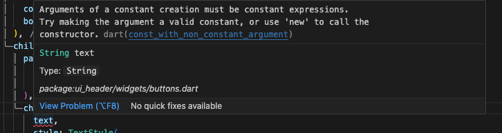

## Intro



자, 위의 Transfer 버튼과 Request 버튼을 보자.  
두 가지 버튼은 비슷하게 생겼다.  

그리고 배경색과 텍스트 컬러 정도만 다르다.  
버튼의 디자인 경향이 비슷한 것이다.  

그리고 이 두 버튼을 만들기 위해 아래와 같은 코드를 작성했다.  

```dart
Container(
decoration: BoxDecoration(
    color: Color(0xFFF1B33B),
    borderRadius: BorderRadius.circular(45),
),
child: const Padding(
    padding: EdgeInsets.symmetric(
    vertical: 15,
    horizontal: 45,
    ),
    child: Text(
    "Transfer",
    style: TextStyle(
        fontSize: 22,
    ),
    ),
),
),
Container(
decoration: BoxDecoration(
    color: Color(0xFF1F2123),
    borderRadius: BorderRadius.circular(45),
),
child: const Padding(
    padding: EdgeInsets.symmetric(
    vertical: 15,
    horizontal: 45,
    ),
    child: Text(
    "Request",
    style: TextStyle(
        fontSize: 22,
        color: Colors.white,
    ),
    ),
),
),
```

그 안의 값만 다른 동일한 구조의 컨테이너를 복사 붙여넣기 해서 사용한 것이다.  
더 나은 방법은 없을까?

이를 위해 커스텀 위젯, 즉 Resusable Widget을 만들어보자  

## Reusable Widget 만들기 - Extract Widget  

가장 쉽게 reusable widget을 만드는 방법은 code action을 이용하는 방법이다.  
먼저, reusable widget으로 만들고 싶은 widget 부분을 선택하자.(마지막 쉼표는 선택하면 안 된다.)  



그리고 나타나는 code action을 클릭하면 Extract Widget 이라는 선택사항이 보인다.  

  

이 code action은 선택한 위젯을 추출하여 reusable widget으로 만들어주는 기능을 가지고 있다. Extract Widget을 선택하면 위젯의 이름을 넣는 설정 창이 나온다.  

  

적절한 위젯의 이름을 넣어주자. 나는 MidButton 이라는 이름으로 설정했다.  
그리고 엔터로 입력하면 원래 컨테이너(버튼)가 있던 자리에는 MidButton() 이라는 위젯으로 대체되었고, 하단에 MidButton에 대한 설정값을 선언한 MidButton 클래스가 생성되어 있는 것을 볼 수 있다.  

  

하지만 이 방법은 너무나도 편리하기 때문에, 내가 직접 위젯을 작성하는 데 익숙해지기 전 까지는 이 방법을 다시 꺼내지는 않을 것이다.  


## Reusable Widget 직접 만들기  

우선, 프로젝트 폴더 > lib 하위에 "widgets"라는 폴더를 만들고 "buttons.dart" 라는 파일을 만들어주자.  



그리고 여기에 Transfer, Request 버튼으로 사용될 위젯을 만들어주도록 하자.  

```dart
import 'package:flutter/material.dart';

class Button extends StatelessWidget{

 @override
  Widget build(BuildContext context) {
    // TODO: implement build
    throw UnimplementedError();
  } 
}
```

다시 복습할 겸 위 코드를 설명해보자.  

(1) 우선 Button 이라는 클래스를 만드는 것이다.  
(2) 그리고 이 버튼은 StatelessWidget을 상속한다.  
(3) 그리고 이 위젯을 build 하는 메서드를 필히 만들어준다.  

이것은 모든 위젯을 만들 때 공통적인 흐름이다. (StatelessWidget은 종류에 따라 달라짐)  
지금 만들고 있는 앱으로 돌아가서 살펴보자.  

앱 또한 하나의 위젯이기 때문에 위와 같이 빌드를 했음을 알 수 있다.  

자 다시 돌아와서, 그러면 이 Button 클래스에 버튼 Container를 가져와보자.  

```dart
import 'package:flutter/material.dart';

class Button extends StatelessWidget{

 @override
  Widget build(BuildContext context) {
    return Container(
                    decoration: BoxDecoration(
                      color: Colors.amber,
                      borderRadius: BorderRadius.circular(45),
                    ),
                    child: const Padding(
                      padding: EdgeInsets.symmetric(
                        vertical: 15,
                        horizontal: 45,
                      ),
                      child: Text(
                        "Transfer",
                        style: TextStyle(
                          fontSize: 22,
                          color: Colors.black,
                        ),
                      ),
                    ),
                  );
  } 
}
```

그 다음에는 이 버튼을 "커스터마이징" 할 수 있게 허용할 부분과 "고정시킬" 부분을 나누도록 해보자.  
다시 한 번 디자인을 살펴보면서 나눠보면 아래와 같다.  

|커스터마이징 허용 부분|고정 부분|
|---|---|
|버튼색상, 폰트색상, 텍스트 내용|버튼모양 및 크기, 폰트모양, 폰트크기|

그러면 커스터마이징 허용할 부분만 변수를 선언해주고, 초기화(생성자) 메서드 즉 Constructor를 클래스 안에 만들어주도록 하면, 이 위젯을 언제든 불러와 커스터마이징 필요한 부분을 초기화 한 다음 편하게 사용할 수 있다.  

```dart
import 'package:flutter/material.dart';

class Button extends StatelessWidget {

  final String text;            // 텍스트 내용
  final Color backgroundColor;  // 버튼 색상
  final Color textColor;        // 폰트 색상

  const Button({                // Constructor
    super.key,
    required this.text,
    required this.backgroundColor,
    required this.textColor,
  });

  @override
  Widget build(BuildContext context) {
    return Container(
      decoration: BoxDecoration(
        color: backgroundColor,    // 변수로 교체
        borderRadius: BorderRadius.circular(45),
      ),
      child: const Padding(
        padding: EdgeInsets.symmetric(
          vertical: 15,
          horizontal: 45,
        ),
        child: Text(
          text,                    // 변수로 교체
          style: TextStyle(
            fontSize: 22,
            color: textColor,      // 변수로 교체
          ),
        ),
      ),
    );
  }
}

```

그런데 이렇게만 하면 text 부분에서 에러가 발생할 것이다.  
에러의 내용은 Argument 들이 constant 로 선언되어있기 때문에 변수값을 받을 수 없다는 내용이다.  

  

살펴보면 Text() 위젯의 부모 위젯이 const로 선언된 Padding 위젯임을 볼 수 있다.  

변수가 들어가는 순간 상수가 될 수 없으므로 에러가 발생하는 것이다.  

이를 해결하기 위해 상수만으로 이루어진 부분만 const로 선언해주고, 나머지는 const를 삭제하도록 한다.  

```dart
import 'package:flutter/material.dart';

class Button extends StatelessWidget {
  final String text;
  final Color backgroundColor;
  final Color textColor;

  const Button({
    super.key,
    required this.text,
    required this.backgroundColor,
    required this.textColor,
  });

  @override
  Widget build(BuildContext context) {
    return Container(
      decoration: BoxDecoration(
        color: backgroundColor,
        borderRadius: BorderRadius.circular(45),
      ),
      // child: const Padding( // const 삭제
      child: Padding(    
        // padding: EdgeInsets.symmetric( // const 추가
        padding: const EdgeInsets.symmetric(
          vertical: 15,
          horizontal: 45,
        ),
        child: Text(
          text,
          style: TextStyle(
            fontSize: 22,
            color: textColor,
          ),
        ),
      ),
    );
  }
}
```

## Reusable Widget 적용하기  

Reusable Widget 을 성공적으로 만들었으니, 이걸 사용해보도록 하자.  
기존 작성중이던 앱 코드로 돌아와서, Reusable Widget 로 만든 Container 부분을 지운 뒤, widget을 사용해보도록 하자.  

```dart
// 기존  
Row(
mainAxisAlignment: MainAxisAlignment.spaceBetween,
children: [
Container(
decoration: BoxDecoration(
    color: Color(0xFFF1B33B),
    borderRadius: BorderRadius.circular(45),),
child: const Padding(
    padding: EdgeInsets.symmetric(
    vertical: 15,
    horizontal: 45,),
    child: Text(
    "Transfer",
    style: TextStyle(
        fontSize: 22,),),),),
Container(
decoration: BoxDecoration(
    color: Color(0xFF1F2123),
    borderRadius: BorderRadius.circular(45),),
child: const Padding(
    padding: EdgeInsets.symmetric(
    vertical: 15,
    horizontal: 45,),
    child: Text(
    "Request",
    style: TextStyle(
        fontSize: 22,
        color: Colors.white,
),),),),])
```

```dart
// 변경
const Row(
mainAxisAlignment: MainAxisAlignment.spaceBetween,
children: [
    const Button(
        text: "Transfer",
        backgroundColor: Color(0xFFF1B33B),
        textColor: Colors.black),
    const Button(
        text: "Request",
        backgroundColor: Color(0xFF1F2123),
        textColor: Colors.white),
],)
```

무척이나 알아보기 쉽고 간편하고, 그리고 버튼을 더 만들기도 쉬운 코드가 되었다.  


## 비교  

원래 쌩 코드와 Reusable Widget을 만들어 준 뒤 적용한 코드를 비교해보자.  

