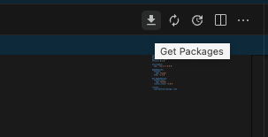

## Services  

Services 폴더를 만들어줄 것이다.  
이 곳에는 Flutter 위젯이나 클래스가 아닌 평범한 Dart 클래스를 만들어주고 백엔드의 서비스를 구현할 것이다.  


## API 서비스 만들기  

우선 API 서비스를 만들기 위해서는 http 통신을 할 수 있도록 http 패키지를 설치해야 한다.  

Flutter나 Dart 패키지를 찾고 싶으면 pub.dev라는 dart, flutter 공식 패키지 보관소에서 찾을 수 있다. Node.js의 npm 그리고 Python의 pip와 같은 것이라고 생각하면 된다.  

[https://pub.dev](https://pub.dev)  

  

여기서 http를 찾으면 된다.  

  


설명을 보면 아래와 같다.  

> HTTP 요청을 만들기 위한 구성 가능한 미래 기반 라이브러리입니다.
이 패키지에는 HTTP 리소스를 쉽게 사용할 수 있게 해주는 고급 함수 및 클래스 세트가 포함되어 있습니다. 다중 플랫폼(모바일, 데스크톱 및 브라우저)이며 여러 구현을 지원합니다.  

위 캡쳐 화면을 잘 살펴보자.  

먼저 이 패키지는 DART.DEV에서 만들었다. 그리고 Null Safety 패키지이며, 안드로이드, IOS, 리눅스 맥OS, 웹, 윈도우 등의 플랫폼에 적용이 가능하다.  

## 패키지 설치하기  

dart 패키지 설치는 몇 가지 방법이 있다.  


위 패키지 소개 페이지에 보면 다음과 같이 패키지를 설치하는 방법이 안내되어 있다.  

1. 커맨드 라인에서 dart 명령을 통해 설치  

With Dart:  

```bash
dart pub add http
```

2. 커맨드 라인에서 flutter 명령을 통해 설치  

With Flutter:  

```bash
flutter pub add http
```

본 명령어를 통해 설치할 때에는 반드시 프로젝트의 Root 위치에서 실행해야 한다.  

3. pubspec.yaml 방식으로 설치  

This will add a line like this to your package's pubspec.yaml (and run an implicit dart pub get):  

```bash
dependencies:
  http: ^1.2.0
Alternatively, your editor might support dart pub 
```

pubspec이란, 프로젝트에 대한 정보, 프로젝트에서 요구하는 패키지와 그 패키지의 버전이 명시되어있는 파일이다. flutter 프로젝트를 만들게 되면 기본적으로 아래와 같이 파일이 함께 생성된다.  

  

주석으로 파일 작성법이 설명되어 있으니 꼭 읽어보기를 바란다.  

패키지는 dependency 부분에 기재하면 되는데, 아래 코드를 참고해보자.  

```yaml
name: wetoon_app
description: "A new Flutter project."
publish_to: 'none'
version: 0.1.0

environment:
  sdk: '>=3.2.5 <4.0.0'

dependencies:
  flutter:
    sdk: flutter
  http: ^1.2.0    # 이 부분을 추가함
...
```

그리고 Vscode에서 pubspec.yaml 파일을 열고있다면 코드스페이스의 오른쪽 상단에 다음과 같이 다운로드 버튼(get packages)이 있는 것을 볼 수 있다.  



이걸 눌러보면 yaml 파일에 적힌 패키지들을 설치해준다.   


## API 서비스 만들기  

http 패키지를 설치하면 관련된 많은 메서드를 사용할 수 있다. 이중 get 메서드를 사용하면 http 통신을 통해 URL에 요청을 보내고 이에 대한 응답을 받아올 수 있다.  

```dart
import 'package:http/http.dart';

class ApiService {
  final String baseUrl = "https://webtoon-crawler.nomadcoders.workers.dev";
  final String today = "today";

  void getTodaysToons() {
    get(baseUrl);
  }
}
```

## NameSpace  

하지만 get() 과 같은 메서드 이름은 너무 흔하기도 하고 커스텀으로도 많이 쓰일 수 있는 메서드명이다.  

이에 따라 NameSpace를 지정해줘서 명확하게 해당 메서드가 무언지를 볼 수 있도록 하겠다.  

NameSpace는 패키지 Import 부분에 AS 를 붙여 작성한다.  

```dart
// NameSpace 적용 전
import 'package:http/http.dart';
get("some url")
```

```dart
// NameSpace 적용 후
import 'package:http/http.dart' as http;
http.get("some url")
```

## http.get 메서드  

http.get 메서드를 살펴보자.  

아래와 같은 설명을 볼 수 있다.  

```dart
Future<Response> get(Uri url, {Map<String, String>? headers})
Type: Future<Response> Function(Uri, {Map<String, String>? headers})

package:http/http.dart

Sends an HTTP GET request with the given headers to the given URL.

This automatically initializes a new [Client] and closes that client once the request is complete. If you're planning on making multiple requests to the same server, you should use a single [Client] for all of those requests.

For more fine-grained control over the request, use [Request] instead.
```

먼저 파라미터로는 Uri를 요구한다. 간단하게는 아래와 같이 사용하면 된다.  

```dart
import 'package:http/http.dart' as http;

void getTodaysToons() {
    final url = Uri.parse(baseUrl + "/" + today);
    http.get(url);
}
```

먼저, 파라미터로 들어가는 Uri 는 Uri.parse 메서드를 통해 String을 파싱해서 얻을 수 있다. 기본적인 사용법이므로 꼭 숙지.  


## 비동기(async) 프로그래밍  

API 요청은 local asset만을 이용한 프로그래밍에 비해 불확실한 부분이 있을 것이다.  

예를 들어 로컬 컴퓨터를 이용해 계산을 하는, 외부와 통신이 없는 프로그래밍이라면 하드웨어의 스펙에 종속된 어느정도 확실한 프로그램 성능, 실행시간을 예상할 수 있을 것이다.  

하지만 API 통신과 같은 경우, API 요청을 받는 서버의 상태와 하드웨어 스펙, 그 당시의 네트워크 통신량, 사용자의 네트워크 상태 등에 따라 그 실행시간을 예상하기 힘들 수 있다.  

또한 꼭 API 요청이 아니더라도 "실행시간이 오래걸리는 기능" 을 생각해봐도 좋다. 어떤 프로그램에서 많은 기능 중 하나의 기능이 계산하는 데 시간이 오래 걸린다고 생각해보자. 프로그램을 실행시킬 때 이 기능 때문에 다른 기능을 작동시키지 못하고 기능 완료때까지 기다려야 한다면 어떻까? 매우 불편할 것이다.  

이 때 비동기 프로그래밍을 사용하면 좋다.

비동기 프로그래밍에 대한 설명은 아래 챗지피티의 답변을 보자  

```bash
비동기 프로그래밍은 프로그램이 여러 작업을 동시에 수행하거나, 작업이 완료될 때까지 대기하지 않고 다른 작업을 계속 수행하는 프로그래밍 패러다임입니다. 이는 주로 I/O 작업이나 네트워크 통신과 같이 시간이 오래 걸리는 작업에 유용하게 쓰입니다. 비동기 프로그래밍은 일반적으로 다음과 같은 특징을 가지고 있습니다:

1. 이벤트 기반 (Event-driven): 비동기 프로그래밍은 주로 이벤트 기반으로 작동합니다. 예를 들어, 사용자의 클릭, 파일의 읽기 완료, 네트워크 응답 등 특정 이벤트가 발생할 때 특정 동작을 수행하도록 설계됩니다.

2. 콜백 함수 (Callback Functions): 비동기 작업이 완료되면 지정된 콜백 함수가 호출됩니다. 이는 작업이 끝나기를 기다리지 않고, 다른 작업을 수행하는 동안에도 결과를 처리할 수 있도록 해줍니다.

3. Promise와 Future: 몇몇 언어 및 라이브러리에서는 Promise(또는 Future)를 사용하여 비동기 작업을 처리합니다. 이를 통해 작업의 성공 또는 실패와 관련된 코드를 구조화할 수 있습니다.

4. 코루틴과 제너레이터 (Coroutines and Generators): 몇몇 언어는 코루틴이나 제너레이터를 통해 비동기 작업을 간소화하고 코드를 더 읽기 쉽게 만들 수 있습니다.

대표적인 비동기 프로그래밍 언어로는 JavaScript, Python (async/await), Java (CompletableFuture), C# (async/await), 등이 있습니다. 각 언어마다 비동기 프로그래밍을 위한 고유한 기능과 문법이 있을 수 있습니다.
```

비동기 처리의 이해를 돕기 위한 유명한 예시가 있으니 참고해보자.  

https://dev-coco.tistory.com/46  

## flutter에서 비동기 프로그래밍을 해보기  

flutter에서는 비동기 프로그래밍의 키워드로 await / async 를 이용한다.  

어떤 요청을 하고 그에 대한 요청을 기다리도록 할 때에는 await 키워드를 해당 메서드의 앞에 붙이면 된다.  

그리고 await 키워드는 async 메서드 안에서만 사용할 수 있다.  
아래 예시를 보자.  

```dart
void getTodaysToons() async {  // async
    final url = Uri.parse(baseUrl + "/" + today);
    await http.get(url);  // await
}
```

자 여기서 앞서 살펴봤던 http.get 메서드에 대한 설명을 다시 살펴보자.  

```dart
Future<Response> get(Uri url, {Map<String, String>? headers})
Type: Future<Response> Function(Uri, {Map<String, String>? headers})

package:http/http.dart
...
```

살펴보면 Future 라는 데이터타입을 return 타입으로 하고 있는 메서드임을 알 수 있다.  

보통 await 데이터타입은 이런 Future 류의 타입과 함께 사용한다.  

즉 Future 데이터타입은 이 메서드의 결과값이 미래에 있을 것이라는 것을 가리킨다. 그리고 결국 미래에 결과물이 나올 때에는 Response 라는 데이터타입을 반환할 것이라는 것을 이 설명을 통해 알 수 있다.  

## API 서비스 만들기  

자 다시 API 서비스 만들기로 돌아와보자.  

결국 http.get 메서드는 Future<Response> 데이터형을 반환함을 알 수 있다. 그렇다면 아래와 같이 작성하면 메서드를 문제 없이 실행시킬 수 있다.  

```dart
void getTodaysToons() async {
    final url = Uri.parse(baseUrl + "/" + today);
    final response = await http.get(url);
}
```

그리고 함수의 실행 결과를 보기 위해 아래와 같이 덧붙여보자.  

```dart
void getTodaysToons() async {
    final url = Uri.parse(baseUrl + "/" + today);
    final response = await http.get(url); // 요청에 대한 응답을 받아옴
    if (response.statusCode == 200) {
      // 요청 처리가 정상(200) 일 경우
      print(response.body);
      return;
    }
    throw Error(); // 요청 처리가 정상이 아닐 경우 Error를 발생시킨다.
}
```

기본적인 http.get 메서드의 사용법 설명을 마친다.  

## 테스트해보기  

만든 API 서비스를 테스트해보고 싶다면 main 메서드 안에 클래스의 메서드를 실행하는 것을 넣어보면 된다.  

```dart
void main() {
  runApp(const MainApp());
  ApiService().getTodaysToons(); // 이렇게
}
```

```json
// 응답
[
    {"id":"758150","title":"입학용병","thumb":"https://image-comic.pstatic.net/webtoon/758150/thumbnail/thumbnail_IMAG21_4135492154714961716.jpg"},
    {"id":"809706","title":"사랑받는 시집살이","thumb":"https://image-comic.pstatic.net/webtoon/809706/thumbnail/thumbnail_IMAG21_de9581cd-9dfc-4500-9c5c-62c4299a5c30.jpg"},
    {"id":"818806","title":"이웃집 연하","thumb":"https://image-comic.pstatic.net/webtoon/818806/thumbnail/thumbnail_IMAG21_e1b66355-0263-4fae-938f-ba9f8ff1ec9f.jpg"},
    {"id":"819910","title":"홍끼의 메소포타미아 신화","thumb":"https://image-comic.pstatic.net/webtoon/819910/thumbnail/thumbnail_IMAG21_3e1f29a1-2233-4e85-bb2f-3232a1b8ab81.jpg"},
    {"id":"818368","title":"피폐물 남주의 엄마가 되었다","thumb":"https://image-comic.pstatic.net/webtoon/818368/thumbnail/thumbnail_IMAG21_dbbb63bc-66fe-4934-a4fa-1a704b0a7ee6.jpg"},
    ...
]
```