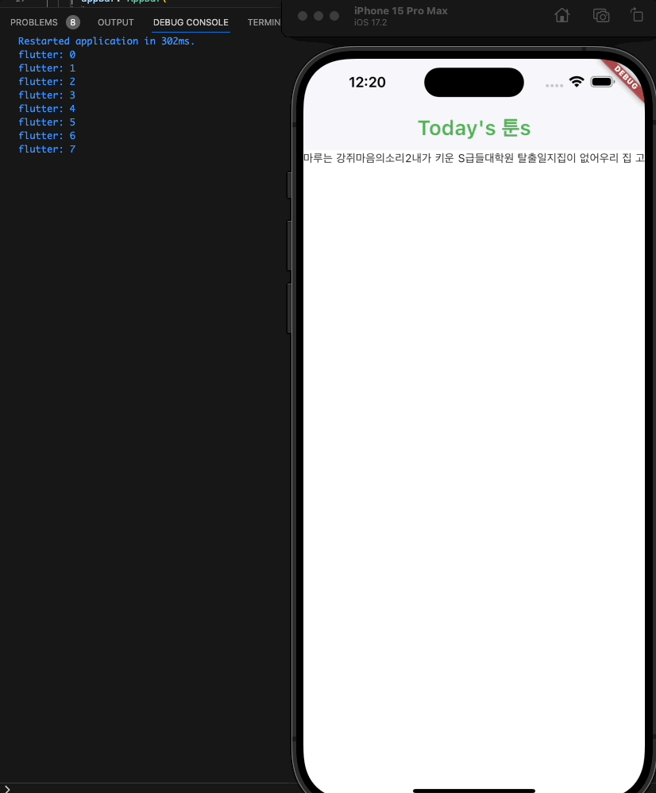
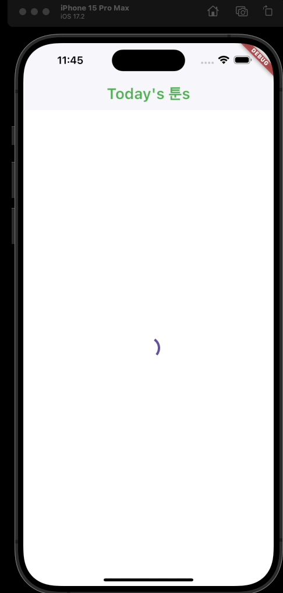

## ListView  


여러 항목을 나열하는데 최적화된 위젯  
굉장히 많은 버전의 ListView가 있다.  

리스트 안의 내용이 많을 경우 자동으로 스크롤을 할 수 있게 해준다.  

```dart
FutureBuilder(
    future: webtoons,
    builder: (context, snapshot) {
        // future builder
        if (snapshot.hasData) {
        // snapshot에 데이터가 있으면
        return ListView(
            children: [
            for (var webtoon in snapshot.data!) Text('${webtoon.title}'),
            ],
        );
        } else {
        // snapshot에 데이터가 없으면
        return Center(child: CircularProgressIndicator());
        }
        // return Text("");
    },
),
```


이렇게 자동으로 리스트를 보여주도록 한다!  
하지만 우리는 webtoon 자료 안에 title 말고도 thumb, id 를 가지고 있기 때문에 이에 대한 최적화를 진행해줘야 한다.  

### ListView.builder  

위 예시는 모든 아이템을 한 번에 로딩하고 있다.  

하지만 생각해보자. 틱톡이나 유튜브, 인스타그램 같은 앱을 만든다고 했을 때 한 번에 모든 아이템을 로딩한다면.. 매우매우 많은 메모리를 사용해야 할 것이다. 타임라인에 있는 모든 사진을 한 번에 로딩해버리기 때문에.  

그래서 사용자가 보고있는 사진이나 섹션만 로딩해야 한다. 그래서 다른 종류의 리스트뷰를 사용해볼 것이다.  

```dart
// ListViewBuilder 에 대한 설명  

// The named parameter 'itemBuilder' is required, but there's no corresponding argument.

Try adding the required argument.dartmissing_required_argument
(new) ListView ListView.builder({
  Key? key,
  Axis scrollDirection = Axis.vertical,
  bool reverse = false,
  ScrollController? controller,
  bool? primary,
  ScrollPhysics? physics,
  bool shrinkWrap = false,
  EdgeInsetsGeometry? padding,
  double? itemExtent,
  double Function(int, SliverLayoutDimensions)? itemExtentBuilder,
  Widget? prototypeItem,
  required Widget? Function(BuildContext, int) itemBuilder,
  int? Function(Key)? findChildIndexCallback,
  int? itemCount,
  bool addAutomaticKeepAlives = true,
  bool addRepaintBoundaries = true,
  bool addSemanticIndexes = true,
  double? cacheExtent,
  int? semanticChildCount,
  DragStartBehavior dragStartBehavior = DragStartBehavior.start,
  ScrollViewKeyboardDismissBehavior keyboardDismissBehavior = ScrollViewKeyboardDismissBehavior.manual,
  String? restorationId,
  Clip clipBehavior = Clip.hardEdge,
})
```

리스트뷰 빌더에 대한 설명인데 이 중 몇 가지만 살펴보자면  

-- itemBuilder : 아이템을 build할 때 호출하는 함수. futurebuilder에 넣어주는 builder와 비슷하다. itemBuilder는 보여줄 만큼의 아이템만 빌드하고, 그 외의 아이템은 빌드하지 않음으로써 메모리를 절약한다. index라는 인덱스로만 아이템에 대해 접근이 가능하다.★★★  
-- ScrollDirection : 스크롤 방향. 수직 또는 수평 방향 (Axis.horizontal : 가로 스크롤 / Axis.vertical : 세로 스크롤)  
-- itemCount : list의 아이템 개수를 설정  

```dart
FutureBuilder(
    future: webtoons,
    builder: (context, snapshot) {
    if (snapshot.hasData) {
        return ListView.builder(  // 리스트뷰 빌더
        scrollDirection: Axis.horizontal,  // 스크롤
        itemCount: snapshot.data!.length,  // 아이템카운트
        itemBuilder: (context, index) {    // 아이템빌더
            print(index);
            var webtoon = snapshot.data![index];  // 빌드할 아이템 선택
            return Text(webtoon.title);  // 아이템을 텍스트로 나타내준다.
        },
        );
    } else {
        return Center(child: CircularProgressIndicator());
    }
    },
),
```

그래서 이렇게 하면 webtoons의 정보를 받아오는데, 보여지는 아이템에 대해서만 빌드함으로써 메모리를 아껴준다.  

이해를 돕기 위해 index 번호를 출력하는 print를 넣어 테스트해보자.  




### ListView.separated  

ListView.separated는 ListView.builder 보다 필수 파라미터를 하나 더 가진다. 바로 separatorBuilder이다.  

separatorBuilder는 위젯을 반환해야하는 함수로, 여기서 반환된 위젯은 리스트 아이템 사이에 렌더링 될 것이다. 이 위젯은 아이템들을 구분(Separate)하기 위해서 사용된다.  

```dart
FutureBuilder(
    future: webtoons,
    builder: (context, snapshot) {
        if (snapshot.hasData) {
        return ListView.separated(
            scrollDirection: Axis.horizontal,
            itemCount: snapshot.data!.length,
            itemBuilder: (context, index) {
                var webtoon = snapshot.data![index];
                return Text(webtoon.title);
            },
            separatorBuilder: (context, index) => SizedBox(
            width: 20,
            ), // separator Builder로 공백 sizedBox를 넣었다.
        );
        } else {
        return Center(child: CircularProgressIndicator());
        }
    },
)
```

  


## 기타 참고  

### CircularProgressIndicator()  

데이터 로딩에서 많이 볼 수 있는 원형으로 빙글빙글 도는 선이다.  



### ListView  

여러 항목을 나열하는데 최적화된 위젯  
굉장히 많은 버전의 ListView가 있다.  