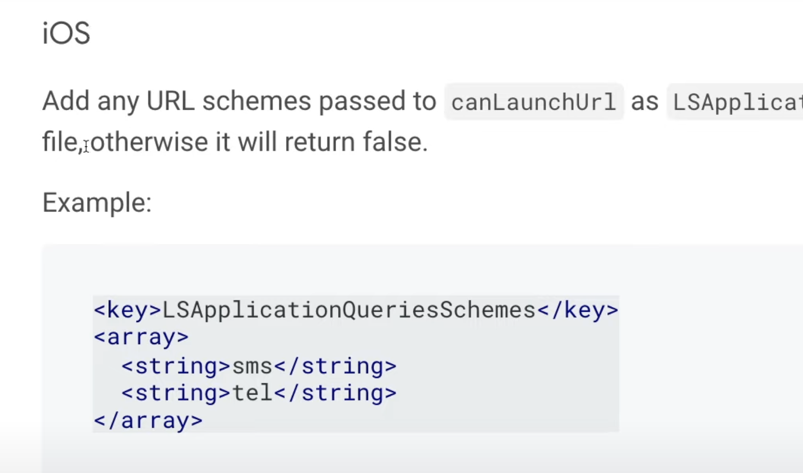
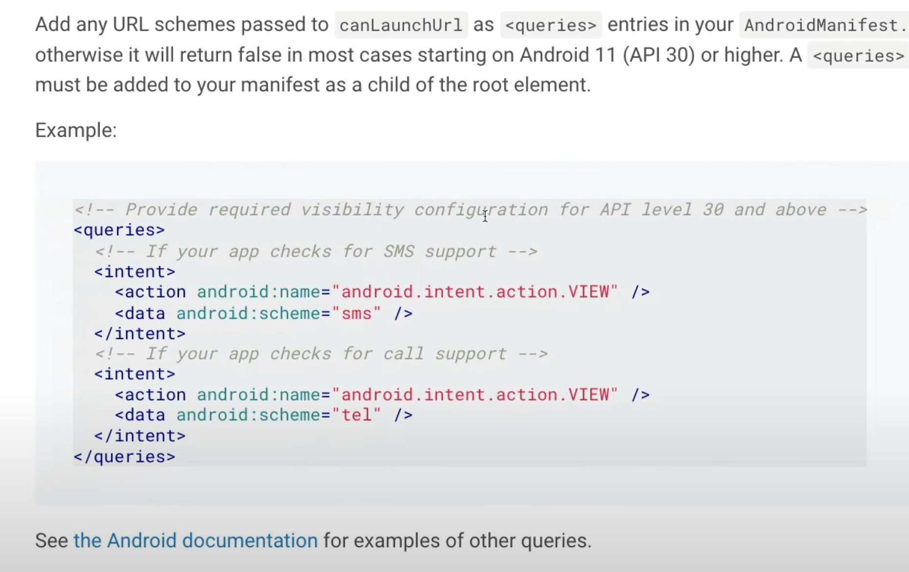
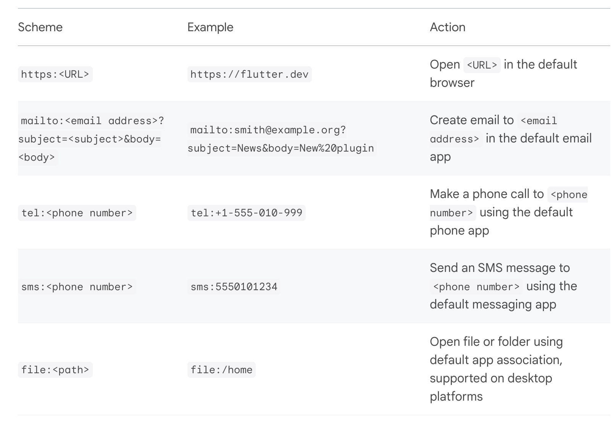
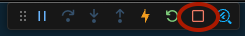
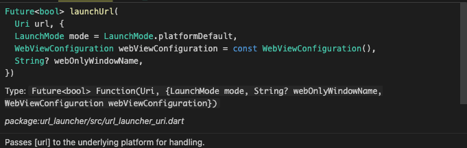
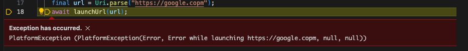

## URL launcher  

Flutter 에서 브라우저를 열게 하기 위해서는 URL launcher 라는 패키지를 설치해야 한다.  

https://pub.dev/packages/url_launcher  

이는 이전에 설치했던 것과 같이 명령어를 통해 설치하거나 dependencies 를 통해 프로젝트에 추가해줘도 된다.  


그리고 iOS 인 경우 일부 설정이 필요한데, info.plist 파일에 아래 내용을 붙여넣어야 한다.  

info.plist 는 프로젝트 폴더의 iOS > runner 폴더 아래에 있다.  



```xml
<key>LSApplicationQueriesSchemes</key>
<array>
  <string>sms</string>
  <string>tel</string>
</array>
```

이것을 넣어줄 때에는 어떤 종류의 url을 열 것인지를 명시해줘야 한다.  
Url Launcher는 HTTP URL 뿐만 아니라 sms URL 이나 TEL URL 도 실행하게끔 할 수 있기 때문에, 어떤 종류의 URL을 열 것인지 명시해줘야 한다.  

이번 프로젝트를 위해 적용한 예시는 아래와 같다.  

```dart
...
    <key>UIApplicationSupportsIndirectInputEvents</key>
	<true/>
	<key>LSApplicationQueriesSchemes</key>
	<array>  // 여기서부터
  		<string>https</string>
	</array>  // 여기까지
</dict>
</plist>
```


그리고 안드로이드라면 AndroidManifest.xml 에 아래 내용을 추가해줘야 한다.  

AndroidManifest.xml은 android > app > src > main 폴더 아래에 있다.  



```xml
<!-- Provide required visibility configuration for API level 30 and above -->
<queries>
  <!-- If your app checks for SMS support -->
  <intent>
    <action android:name="android.intent.action.VIEW" />
    <data android:scheme="sms" />
  </intent>
  <!-- If your app checks for call support -->
  <intent>
    <action android:name="android.intent.action.VIEW" />
    <data android:scheme="tel" />
  </intent>
  <!-- If your application checks for inAppBrowserView launch mode support -->
  <intent>
    <action android:name="android.support.customtabs.action.CustomTabsService" />
  </intent>
</queries>
```

마찬가지로 이것을 넣어줄 때에는 어떤 종류의 url을 열 것인지를 명시해줘야 한다.  
Url Launcher는 HTTP URL 뿐만 아니라 sms URL 이나 TEL URL 도 실행하게끔 할 수 있기 때문에, 어떤 종류의 URL을 열 것인지 명시해줘야 한다.  



URL Launcher 를 통해 작동시킬 수 있는 URL의 종류는 위와 같다. 2024-02-18 현재 http, mail, tel, sms, file 총 5가지의 URL을 작동시킬 수 있다.  


iOS, Android 설정파일을 수정했다면 프로젝트를 중지시킨 후 재시작해줘야 한다. 이유는 이 설정파일이 프로젝트가 실행될 초기에 적용되기 때문이다. 이 경우는 hotreloading(바로 적용)이 안된다.  




만약 URL Launcher 를 설정파일에 넣고 앱 재실행이 안된다면 DEBUG CONSOLE 을 살펴보자. 혹 COCOA POD 문제가 발생한다면, COCOA POD을 설치하거나 재설치해야 한다. 이에 대한 자세한 사항은 아래 URL을 참고하자.  

https://guides.cocoapods.org/using/getting-started.html#installation


## URL Launcher 를 작동시킬 메서드  

다음은 URL Launcher를 작동시킬 메서드를 만드는 단계이다.  

Detail Screen으로 가서 onButtonTap() 이라는 메서드를 만든다.  

```dart
...
  @override
  void initState() {
    super.initState();
    webtoon = ApiService.getToonById(widget.id);
    episodes = ApiService.getLatestEpisodesById(widget.id);
  }

  // 사용 방법 1 : Uri 객체를 만든 뒤 이를 넣어주기
  void onButtonTap() async {
    final url = Uri.parse("https://google.copm");
    await launchUrl(url);
  }

  // 사용 방법 2 : String으로 URL을 넣기
  void onButtonTap() async {
    await launchUrlString("https://google.copm");
  }

  @override
  Widget build(BuildContext c
...
```

launchUrl 은 바로 앞에 설치했던 URL Launcher의 메서드이다.  
그리고 이 메서드는 Future 형태를 가지고 있다.  



그러니 async와 await를 이용해 비동기 처리를 해줘야 한다.  


## Gesture Detector  

이제 버튼을 누를 수 있게 만들어줘야 한다.  
이전에 만든 Container Box 에 GestureDetector를 감싸줘 눌리는 버튼으로 만들어주자.  

(이거 하기 전에 해당 컨테이너는 별도 위젯으로 export 했다.)

```dart
class Episode extends StatelessWidget {
  const Episode({
    super.key,
    required this.episode,
  });

  final WebtoonEpisodeModel episode;

  // 사용 방법 1 : Uri 객체를 만든 뒤 이를 넣어주기
  // void onButtonTap() async {
  //   final url = Uri.parse("https://google.copm");
  //   await launchUrl(url);
  // }

  // 사용 방법 2 : String으로 URL을 넣기
  void onButtonTap() async {
    await launchUrlString("https://google.copm");
  }

  @override
  Widget build(BuildContext context) {
    return GestureDetector(
      onTap: onButtonTap,
      child: Container(
        margin: EdgeInsets.only(bottom: 7), // container 들끼리 띄우기
        decoration: BoxDecoration(
            color: Colors.green.shade400,
            borderRadius: BorderRadius.circular(20)),
        child: Padding(
          padding: const EdgeInsets.symmetric(
            vertical: 10,
            horizontal: 40,
          ),
          child:
              Row(mainAxisAlignment: MainAxisAlignment.spaceBetween, children: [
            Text(
              episode.title,
              style: TextStyle(
                color: Colors.white,
                fontWeight: FontWeight.w500,
                fontSize: 20,
              ),
            ),
            Icon(
              Icons.chevron_right_rounded,
              color: Colors.white,
              size: 30,
            )
          ]),
        ),
      ),
    );
  }
}
```

그리고 눌러보면 ...  




오류가 발생했다.

살펴보니 google.com 의 주소를 google.copm으로 잘못 입력해줬다.  

```dart
await launchUrlString("https://google.copm");
```

이를 제대로 수정해서 다시 실행하니 잘 실행이 된다.  


이 오류에 대한 chatGPT의 답변은 아래와 같으니 참고  

```bash
Flutter에서 PlatformException은 플랫폼과의 상호 작용 중에 오류가 발생할 때 발생하는 예외입니다. 이 예외는 Android 또는 iOS와 같은 특정 플랫폼과의 통신 중에 문제가 발생할 때 발생할 수 있습니다. 이 예외는 주로 네트워킹, 파일 시스템 액세스, 디바이스 하드웨어 사용과 같은 작업 중에 발생합니다.

PlatformException이 발생하는 일반적인 이유는 다음과 같습니다:

플랫폼 코드와의 통신 오류: Flutter 앱이 플랫폼 코드 (Java, Kotlin, Swift, Objective-C 등)와 상호 작용할 때 통신 오류가 발생할 수 있습니다.

권한 문제: 앱이 특정 기능이나 리소스에 액세스하기 위해 필요한 권한이 없거나 부족한 경우 PlatformException이 발생할 수 있습니다.

잘못된 파라미터 전달: 플랫폼 메서드에 전달되는 인수가 잘못된 경우 PlatformException이 발생할 수 있습니다.

네트워크 연결 문제: 특히 네트워크 관련 작업에서는 네트워크 연결이 끊겼거나 서버 응답이 없는 경우에 PlatformException이 발생할 수 있습니다.

비동기 작업의 완료 여부 확인: 비동기 작업이 완료되기 전에 결과를 사용하려고 할 때 PlatformException이 발생할 수 있습니다.

PlatformException을 처리하려면 try-catch 블록을 사용하여 예외를 적절히 처리할 수 있습니다. 이를 통해 앱이 오류에 강건하게 대응하고 사용자에게 적절한 메시지를 표시할 수 있습니다.
```

## 네이버 웹툰에 연결하기  

Google.com 으로 테스트를 해봤으니 실제 네이버웹툰의 에피소드 url 로 연결되도록 해야한다.  

네이버 웹툰의 회차 URL을 보면 아래와 같이 생겼다.  

```bash
https://comic.naver.com/webtoon/detail?titleId=728750&no=249&week=mon
```

살펴보면 titleId 뒤쪽에 웹툰 id가 들어가고 no 뒤쪽에 에피소드 넘버가 들어감을 알 수 있다.  

그러면 우선 onButtonTap 메서드를 수정해서 네이버 웹툰으로 들어갈 수 있게 해준다.  

```dart
// episode.dart
void onButtonTap() async {
    final url = Uri.parse("https://comic.naver.com/webtoon/detail?titleId=${webtoonId}&no=${episode.id}&week=mon");
    await launchUrl(url);
  }
```

그런데 Episode 클래스에는 episode 에 대한 내용은 받고 있지만, webtoon에 대한 내용은 받고 있지 않다. 그러므로 detail_screen에서 사용하는 Episode 클래스에 webtoon id 값도 넘겨주도록 한다.  

```dart
// detail_screen.dart
FutureBuilder(
    future: episodes,
    builder: (context, snapshot) {
        if (snapshot.hasData) {
        return Column(
            children: [
            for (var episode in snapshot.data!)
                Episode(episode: episode, webtoonId: widget.id) // 여기
            ],
        );
        }
        return Container();
    },
)
```

보면 webtoonId 라는 property에 widget.id 값을 넘겨주고 있음을 알 수 있다.  
detail_screen.dart 에는 id property 값을 webtoon.id 값으로 초기화해주고 있기 때문에 이 위젯의 id 라는 property에 접근하기 위해 widget.id라고 사용하게 된다.  

그리고 다시 episode.dart에 넘어가서 제대로 작동하는지 살펴본다.  
물론 episode.dart에 webtoonId 라는 property를 추가해줘야 한다.  

```dart
// episode.dart

class Episode extends StatelessWidget {
  final WebtoonEpisodeModel episode;
  final webtoonId;

  const Episode({
    super.key,
    required this.episode,
    required this.webtoonId,
  });

  // 사용 방법 1 : Uri 객체를 만든 뒤 이를 넣어주기
  void onButtonTap() async {
    final url = Uri.parse(
        "https://comic.naver.com/webtoon/detail?titleId=${webtoonId}&no=${episode.id}&week=mon");
    await launchUrl(url);
  }
```

자 완성이다. 결과물은 아래  

  

