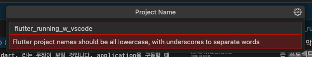
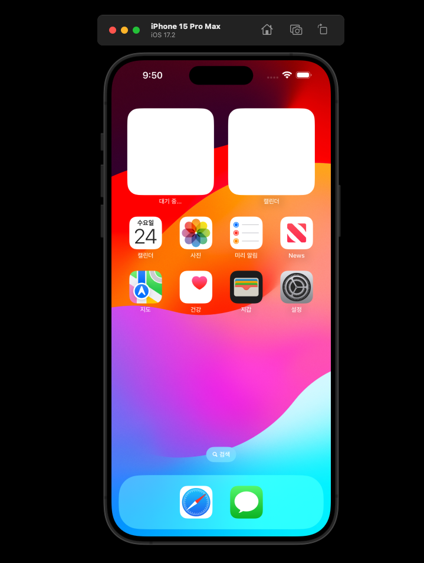
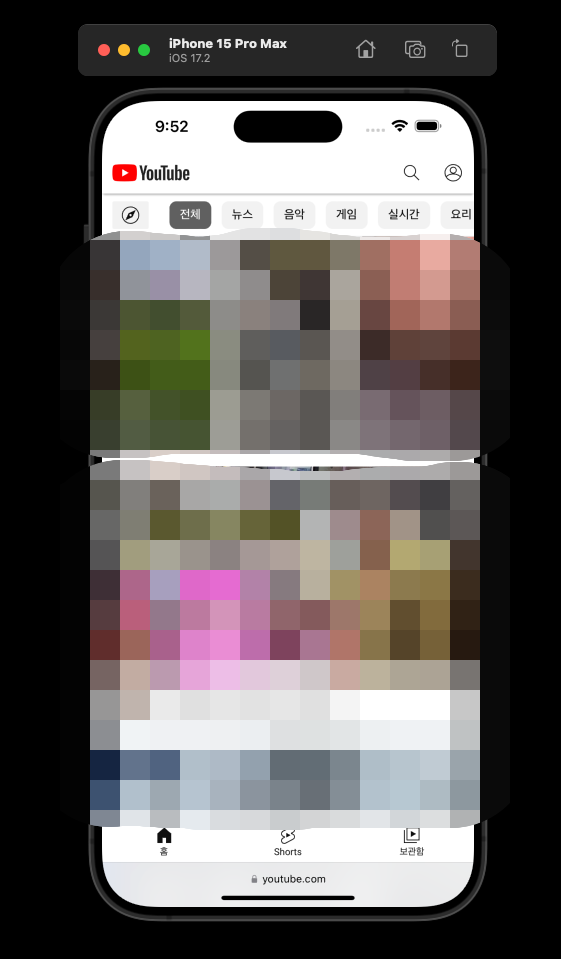
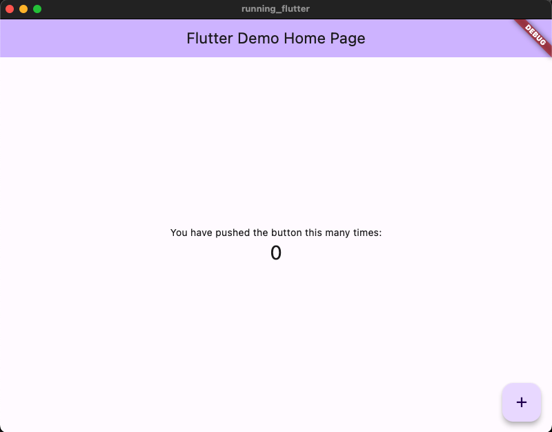
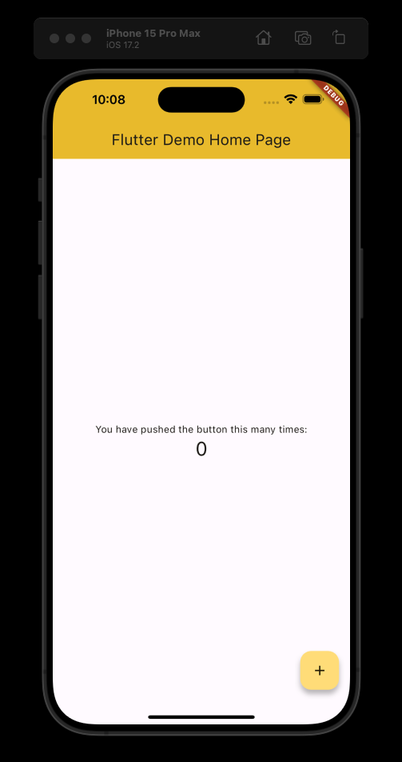

## Intro  

자 이제 flutter 프로젝트를 만들어보겠습니다.  
프로젝트를 만드는 방법은 여러 가지가 있는데요, 아래 두 가지 방법을 소개하겠습니다.  

(1) 터미널에서 flutter 프로젝트 만들기  
(2) VScode에서 flutter 프로젝트 만들기  

두 방법 중 자신에게 편한 방법으로 만들어주면 됩니다.  


## Flutter 프로젝트 만들기  

### (1) 터미널에서 flutter 프로젝트 만들기  

먼저 터미널을 열고, 프로젝트 폴더를 만들만한 곳으로 이동합니다.  

```bash
cd /프로젝트/상위/폴더/
```

그리고 `flutter create 프로젝트명`을 입력해줍니다.  

```bash
flutter create running_flutter
Creating project running_flutter...
Resolving dependencies in running_flutter... (1.6s)
Got dependencies in running_flutter.
Wrote 129 files.

All done!
You can find general documentation for Flutter at: https://docs.flutter.dev/
Detailed API documentation is available at: https://api.flutter.dev/
If you prefer video documentation, consider:
https://www.youtube.com/c/flutterdev

In order to run your application, type:

  $ cd running_flutter
  $ flutter run

Your application code is in running_flutter/lib/main.dart.
```

가장 마지막 줄을 보면 Your application code is in running_flutter/lib/main.dart. 라는 문장이 보일 것입니다. application을 구동할 때 가장 처음 구동되는 entry code는 `프로젝트명/lib/main.dart` 라고 써 있습니다.  


### (2) VScode에서 flutter 프로젝트 만들기  

`Ctrl(cmd) + Shift + P` 를 입력해 팔레트를 열어주고, `flutter: new project` 를 선택해주세요.  


Application 을 선택해준 뒤


프로젝트 폴더를 만들 상위 폴더 경로를 선택하고 `Select a folder to create the project in` 버튼을 클릭해줍니다.  


프로젝트의 이름을 입력해주세요.  



자 이제 플러터 프로젝트가 만들어졌습니다.  


### (3) 프로젝트 만들 때 주의할 점  

**프로젝트 이름**  
-- 프로젝트의 이름은 영어 소문자와 숫자만 넣을 수 있습니다.  
-- 영어 소문자로 시작되어야 합니다. 숫자로 시작되어서는 안됩니다.  
-- underscore(_) 는 사용할 수 있습니다.  

**프로젝트 폴더**  
-- 프로젝트를 만들면, 선택한 경로에 프로젝트 폴더가 생성됩니다.  
-- 프로젝트 폴더에는 dart_tool, android, ios, lib .. 등의 폴더와 yaml, iml 폴더 등이 존재할 것입니다.  


## 시뮬레이터 작동  

시뮬레이터는 내가 만든 어플리케이션이 어떤 플랫폼에서 어떻게 작동하는지, 어떻게 보여지는지 시뮬레이트를 할 수 있는 기능을 제공합니다.  
VScode 를 사용해 프로그래밍을 한다면, VScode 우측 하단에 시뮬레이터를 선택할 수 있는 부분이 있습니다.  

  

이 부분을 클릭하면 VScode 팔레트에 Select device 창이 나옵니다. 여기에서 원하는 시뮬레이터를 선택해주세요.  
저는 iOS를 선택해보도록 하겠습니다.  

  

선택 후 조금 기다리면 시뮬레이터 화면이 나타납니다.  



이 시뮬레이터는 테스트용 아이폰이라고 생각하면 됩니다.  
앱 동작도 되고, 사파리를 통해 웹 브라우징도 가능하죠.  

  


그리고 위쪽의 File > Open Simulator 에서 스마트폰 기종도 선택할 수 있습니다.  


그 외에도 macOS, Windows, Linux, Android 시뮬레이터도 작동시킬 수 있습니다.  


## 프로젝트 Run  

자 그러면 플러터 프로젝트를 실행시켜보겠습니다.  

lib 폴더의 main.dart 코드를 열어주고 Start Debugging 버튼을 클릭합니다.  

  

그러면 짠! 기본 Flutter 프로젝트의 화면이 나타납니다.  
우측 하단의 + 버튼을 클릭하면 화면 중앙의 숫자가 올라가는 어플리케이션이죠.  

  

그리고 코드를 변경하고 저장하면, 예를 들어 Color Schema를 변경하고 저장해보면..  

  

바로 애플리케이션에 적용되는 것을 볼 수 있습니다.  

  

그리고 앞서 살펴본 시뮬레이터. 시뮬레이터를 iOS로 적용한 다음 Run 버튼을 누르면, 해당 시뮬레이터에서 애플리케이션이 작동되는 화면을 볼 수 있습니다.  

