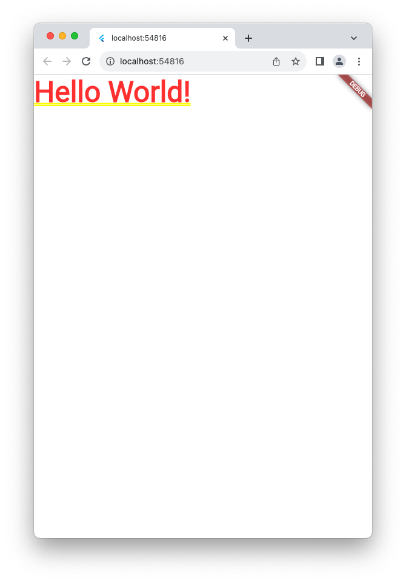

## My App  

Flutter 프로젝트를 만들면 가장 처음 볼 수 있는 부분  

```dart
import 'package:flutter/material.dart';

void main() {
  runApp(const MyApp());
}
```

여기서 runApp 이라는 함수는 `flutter/material.dart` 패키지 안에 존재하는 함수인데 리턴값이 없는 void function 이다.  
이 함수 위에 마우스를 올려 그 설명을 보게 되면 아래와 같다.  

```dart
void runApp(Widget app)
Type: void Function(Widget)

package:flutter/src/widgets/binding.dart

Inflate the given widget and attach it to the screen.

The widget is given constraints during layout that force it to fill the entire screen. If you wish to align your widget to one side of the screen (e.g., the top), consider using the [Align] widget. If you wish to center your widget, you can also use the [Center] widget.

Calling [runApp] again will detach the previous root widget from the screen and attach the given widget in its place. The new widget tree is compared against the previous widget tree and any differences are applied to the underlying render tree, similar to what happens when a [StatefulWidget] rebuilds after calling [State.setState].

Initializes the binding using [WidgetsFlutterBinding] if necessary.
```

이 설명에서 보면 알 수 있듯, 이 `runApp` 함수에는 app 이라는 파라미터가 필요한데, 이 파라미터의 데이터타입이 `widget` 이다.  


## Widget  

위젯은 플러터에서 UI를 만드는 레고블럭이다.  
이 위젯들을 합치는 방식으로 앱을 만들어낸다.  


위의 시뮬레이터를 보자. 여길 보면 가장 상단에 navigation widget이 있고, 하단 오른쪽에는 + 버튼 위젯이 있다.  
그리고 텍스트가 위치해있는 center 라는 위젯이 있고, 여기에 텍스트가 쓰여있다.  

공식 위젯과 커뮤니티에 많은 위젯들이 있다.  

공식 위젯  

[https://docs.flutter.dev/ui/widgets](https://docs.flutter.dev/ui/widgets)  

애니메이션, 레이아웃, 컴포넌트 등 많은 위젯들이 있다.  


### Widget 만들기  

widget은 결국 클래스의 한 종류이다.  
widget을 만드는 방법은 클래스를 만드는 것과 동일하다. 여기에 flutter SDK에 있는 3개의 core Widget 중 하나를 상속받아 선언하면 된다.  

가장 먼저 예시로 Stateless Widget을 상속받은 App 이라는 Widget을 만들어보겠다.  
Stateless Widget을 만들기 위해서는 build 라는 메서드를 정의해야 한다.  

build 메서드는 Widget의 UI를 만드는 역할로, Flutter는 이 build라는 메서드가 return 하는 값을 화면에 보여주게 된다.  
build 메서드의 return type 은 widget 이다.  

```dart
import 'package:flutter/material.dart';

void main() {
  runApp(App());
}

class App extends StatelessWidget{

  @override
  Widget build(BuildContext context) {
    // TODO: implement build
    throw UnimplementedError();
  }
  
}
```

### Root Widget - App()  

runApp 메서드에 파라미터로 들어가게 되는 App() 은 이 프로젝트를 통해 만들어지는 애플리케이션의 가장 기초, 그러니까 Root Widget이 된다.  
여기서부터 프로그래밍 된 모든 Widget들이 모여 이 App()에 쌓여 애플리케이션이 되는 것이다.  

이 Root Widget은 아래 두 가지 중 하나를 return 해야 한다.  
-- material 애플리케이션 : 구글의 디자인 시스템  
-- cupertino 애플리케이션 : 애플의 디자인 시스템   

이들은 각각 구글과 애플의 디자인 시스템이다.  

이 둘은 앱의 디자인 패밀리 즉, 우리 앱이 어떻게 보이고 싶은지를 결정하는 게 된다.  

  
*출처 : https://flutteragency.com/adaptive-ui-for-android-and-ios-using-material-and-cupertino/*

이를 통해 기본 UI 설정을 정해주게 된다.  
많은 책과 강좌에서 Material 애플리케이션을 선택하고 있는데, 이는 아무래도 flutter를 구글에서 만들었다보니..  

하지만 걱정하지 말자. 이렇게 정한 애플리케이션 디자인 시스템에서 구글 혹은 애플의 색깔을 빼는 데는 그렇게 오래 걸리지 않는다.  
즉, 나만의 UI 스타일을 적용해줄 수도 있다는 것이다.  


### Root Widget 만들기 계속  

그러면 이어서 Root Widget을 만들어보자.  
강좌에서 추천하는 것 처럼 material application을 return 하도록 하겠다.  

```dart
import 'package:flutter/material.dart';

void main() {
  runApp(App());
}

class App extends StatelessWidget{

  @override
  Widget build(BuildContext context) {
    // TODO: implement build
    throw UnimplementedError();
    return MaterialApp();
  }
}
```

여기에 있는 MaterialApp() 을 살펴보면, 이 또한 Class 임을 알 수 있다.  

```dart
(new) MaterialApp MaterialApp({
  Key? key,
  GlobalKey<NavigatorState>? navigatorKey,
  GlobalKey<ScaffoldMessengerState>? scaffoldMessengerKey,
  Widget? home,
  Map<String, Widget Function(BuildContext)> routes = const <String, WidgetBuilder>{},
  String? initialRoute,
  Route<dynamic>? Function(RouteSettings)? onGenerateRoute,
  List<Route<dynamic>> Function(String)? onGenerateInitialRoutes,
  Route<dynamic>? Function(RouteSettings)? onUnknownRoute,
  bool Function(NavigationNotification)? onNavigationNotification,
  List<NavigatorObserver> navigatorObservers = const <NavigatorObserver>[],
  Widget Function(BuildContext, Widget?)? builder,
  String title = '',
  String Function(BuildContext)? onGenerateTitle,
  Color? color,
  ThemeData? theme,
  ThemeData? darkTheme,
  ThemeData? highContrastTheme,
  ThemeData? highContrastDarkTheme,
  ThemeMode? themeMode = ThemeMode.system,
  Duration themeAnimationDuration = kThemeAnimationDuration,
  Curve themeAnimationCurve = Curves.linear,
  Locale? locale,
  Iterable<LocalizationsDelegate<dynamic>>? localizationsDelegates,
  Locale? Function(List<Locale>?, Iterable<Locale>)? localeListResolutionCallback,
  Locale? Function(Locale?, Iterable<Locale>)? localeResolutionCallback,
  Iterable<Locale> supportedLocales = const <Locale>[Locale('en', 'US')],
  bool debugShowMaterialGrid = false,
  bool showPerformanceOverlay = false,
  bool checkerboardRasterCacheImages = false,
  bool checkerboardOffscreenLayers = false,
  bool showSemanticsDebugger = false,
  bool debugShowCheckedModeBanner = true,
  Map<ShortcutActivator, Intent>? shortcuts,
  Map<Type, Action<Intent>>? actions,
  String? restorationScopeId,
  ScrollBehavior? scrollBehavior,
  bool useInheritedMediaQuery = false,
})
```

많은 property 들이 보인다.  

이 중 먼저 Home property를 초기화해보자.  

```dart
import 'package:flutter/material.dart';

void main() {
  runApp(App());
}

class App extends StatelessWidget{

  @override
  Widget build(BuildContext context) {
    // TODO: implement build
    return MaterialApp(
      home: Text("Hello World!"),
    );
    throw UnimplementedError();
  }

}
```



와.. 무지 못생겼다.  


### Scaffold  

이 못생긴 앱을 우리가 알고있는 기존의 앱들과 비슷하게 보이려면 어떻게 해야할까?  

바로 scaffold 라는 것을 이용하면 편하다.  

scaffold는 원래 공사장에서 쓰이는 "비계" 를 의미한다.  
비계는 건설현장에서 쓰이는 가시설물 등으로, 아래와 같이 생겼다.  


즉 애플리케이션을 하나의 건축물이라고 예를 들었을 때, 이 scaffold 를 통해 애플리케이션 UI 의 틀을 쉽게 잡아줄 수 있다.  

이 scaffold 를 이용해 MaterialApp의 home을 구축해보겠다.  
home: Text 대신, scaffold 를 입히고, 그 안에 Text 를 써보도록 하자.  

```dart
import 'package:flutter/material.dart';

void main() {
  runApp(App());
}

class App extends StatelessWidget{

  @override
  Widget build(BuildContext context) {
    // TODO: implement build
    return MaterialApp(
      home: Scaffold(
        body: Text("Hello World!"),
      ),
    );
    throw UnimplementedError();
  }

}
```

  

좀 나아졌다.  

여기서 body는 html에서의 body와 같다고 생각하면 좋을 것으로 보인다.  

그러면 또 하나를 더해서 우리가 알고 있는 애플리케이션의 모습에 더 가까워져보자.  
바로 appBar라는 것을 이용해서.  

이제부터는 iOS 시뮬레이터로 대신하겠다.  


### flutter SDK의 3가지 core Widget  

|widget|설명|
|---|---|
|StatelessWidget||