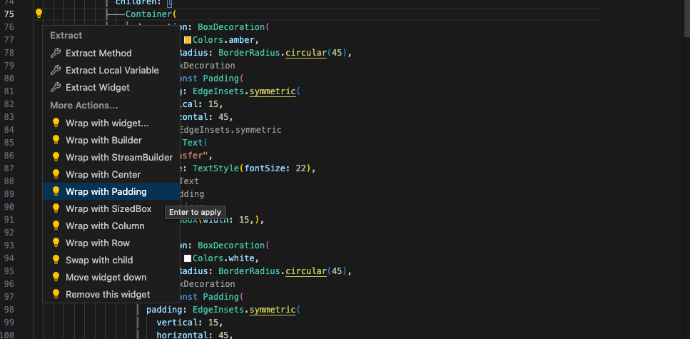
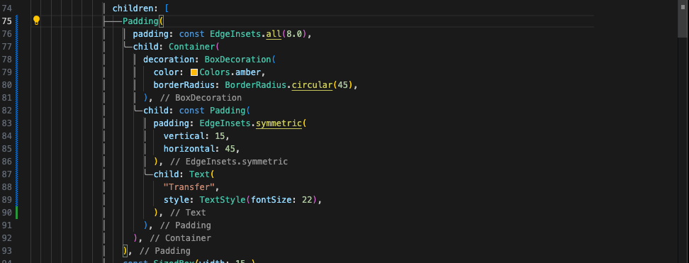
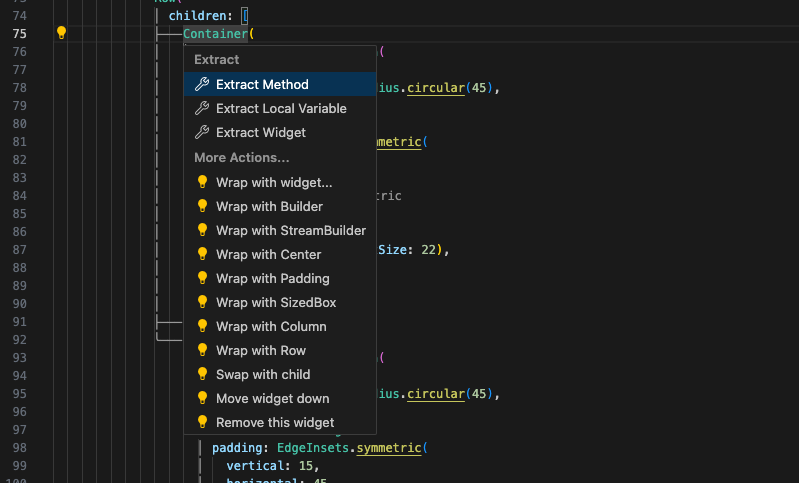

## Code Action

코드 액션은 매우 간단한 방법으로 코드를 리팩토링 해주는 기능이다.  

  

코드를 선택했을 때 왼쪽에 나타나는 전구 모양이 바로 이것이다.  

이걸 눌러보면 많은 기능들이 있다.  

예를 들어 Wrap with Padding 이면 현재 선택한 부분을 Padding으로 감싸주는 것이다.  

  

  

그리고 다시 code action을 눌러서 remove this widget을 선택하면 해당 위젯이 사라진다.  

  

  

그리고 이 code action 은 단축키로도 실행할 수 있는데  
단축키는 Control + . (맥은 command + .) 이다.  

  

