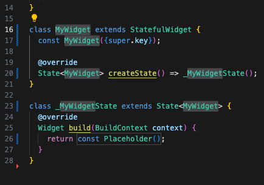
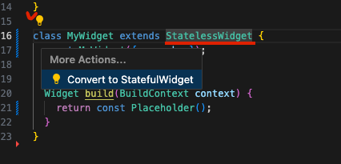
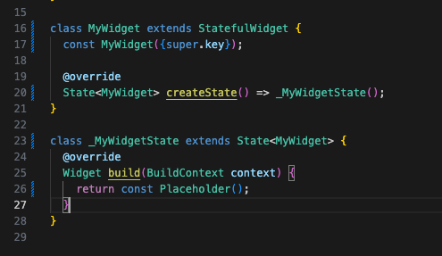
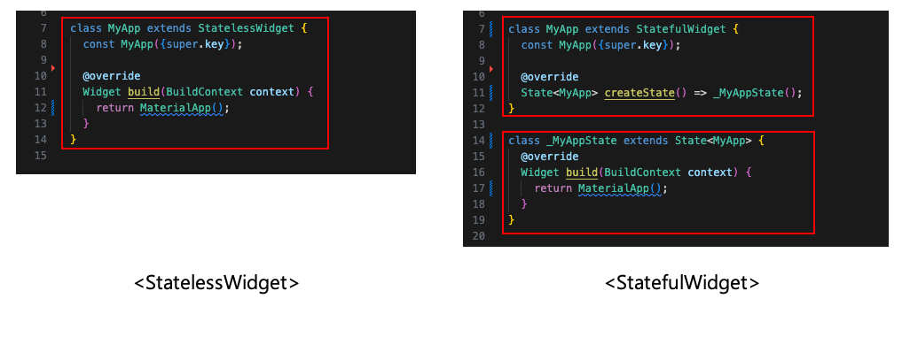
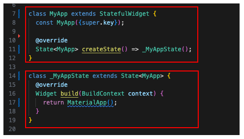

## StatelessWidget 과 StatefulWidget의 차이  

지금까지 사용한 것은 StatelessWidget 임.  
StatelessWidget은 build 메서드를 통해 단지 UI를 출력하는 위젯임. 말하자면 정적 페이지.  

그리고 StatefulWidget은 상태를 가지고 있기 때문에 Stateful이라고 불림.  
즉, 상태나 데이터에 따라 변할 수 있다는 것임.  
즉 동적 페이지라고 보면 됨  

정적 컨텐츠와 동적 컨텐츠에 대해서는 아래 글을 참고  
https://whdrns2013.github.io/computerscience/20240102_001_static_dynamic_content/  

StatefulWidget은 크게 두 부분으로 이루어져있는데  
첫 번째는 상태가 없는 위젯 그 자체이다.  
두 번째는 위젯의 "상태"로 위젯에 들어갈 데이터와 UI를 넣는 곳이다.  

## StatefulWidget 만들기  

### StatefulWidget 만들기  

StatefulWidget을 만드는 방법은 다음과 같다.  
우선 Flutter 프로젝트를 만들어준다.  

https://whdrns2013.github.io/flutter/20240128_003_make_flutter_project/  

  

그리고 st 라는 키워드를 적으면 Flutter Stateful Widget 이라는 자동완성을 볼 수가 있다.  
(그리고 그 아래는 Stateless Widget 자동완성도 보인다.)  

  

그리고 해당 자동완성을 선택하면 위와 같이 StatefulWidget을 만드는 기본 틀이 생성된다.  

### Stateless 를 Stateful로 바꾸기  

추가로, Stateless 위젯을 Stateful로 만들 수도 있다.  

  

위와 같은 StatelessWidget이 있다고 해보자.  

  

StatelessWidget에 커서를 둔 뒤 CodeAction에서 Convert to Stateful Widget을 선택해주면  



짜잔 위와 같이 StatefulWidget 으로 변경된다.  


## StatefulWidget 살펴보기  



StatefulWidget을 살펴보자.  
앞서 말한 대로 두 부분으로 이루어져 있다.  
(StatelessWidget과 비교해보자)  

  

StatefulWidget의 첫 번째 부분은 앱 그 자체를 가리킨다.  
그리고 이 부분은 MyAppState 라는 것만을 가지고 있는, 매우 적은 양의 코드를 가지고 있다.  

```dart
class MyApp extends StatefulWidget {  // class MyApp
  const MyApp({super.key});

  @override
  State<MyApp> createState() => _MyAppState();
}
```

그리고 두 번째 부분은 앞서 본 첫 번째 부분에서 보이는 MyAppState 부분이다.  
이 곳을 핵심적으로 봐야 한다.  
이곳은 UI 를 구축할 뿐만 아니라 데이터를 담는 property 들을 정의하기도 한다.  

```dart
class _MyAppState extends State<MyApp> {
  @override
  Widget build(BuildContext context) {
    return MaterialApp();
  }
}
```


## StatefulWidget 맛보기  

간단한 StatefuleWidget을 만들어보도록 하자.  
우선 다른 부분보다 AppState 부분만을 수정해보도록 하겠다.  

```dart
class _MyAppState extends State<MyApp> {
  int counter = 0;

  void onClicked() {
    counter += 1;
  }

  @override
  Widget build(BuildContext context) {
    return MaterialApp(
        home: Scaffold(
      backgroundColor: Color(0xFFF4EDDB),
      body: Center(
          child: Column(
        mainAxisAlignment: MainAxisAlignment.center,
        children: [
          Text(
            'Click Count',
            style: TextStyle(
              fontSize: 30,
            ),
          ),
          Text(
            '$counter',
            style: TextStyle(
              fontSize: 30,
              color: Colors.red,
            ),
          ),
          IconButton(
            onPressed: onClicked,
            icon: Icon(
              Icons.add_box_rounded,
              size: 40,
            ),
          ),
        ],
      )),
    ));
  }
}
```

counter 라는 property는 늘어나는 숫자 데이터를 담는 property이다.  
그리고 여기선 final이 아니라, 변동될 수 있도록 아무런 수식어도 붙여주지 않은 상태이다.  
어떤 property가 상황에 따라 혹은 데이터에 따라 상태(혹은 값)이 바뀔 수 있다면 final로 설정하면 안된다.  

onClicked는 버튼을 클릭했을 때 발생하는 일을 정의한 함수이다.  
실행될 때마다 counter property에 저장된 값을 1씩 더해준다.  

그 안에 있는 setState 메서드는 State 클래스에게 데이터가 변경되었다고 알려주는 함수이다.  
그래서 State가 반응해서 뭔가 하고 스스로 새로고침하라고 알려주는 것이다.  
이 setState는 "데이터가 변화되는 메서드를 감싸거나" "데이터가 변화되는 메서드 뒤에" 사용하는 방식으로 사용해야 한다.  
새로고침이라 보면 편할 것이다.  
기본적으로는 setState 안쪽에 메서드를 넣는 것을 권장한다.  
setState가 실행되면 build에 포함된 부분이 다시금 재 빌드 된다.  
혹시 변경된 데이터를 바로 보여주고 싶지 않은 경우엔 setstate를 사용하지 않거나 나중에 사용하면 된다.  

그 아래 위젯들은 UI를 나타내고 있다.  
위 위젯을 실행하면 아래와 같이 아이콘을 클릭할 때마다 숫자가 증가하는 앱이 실행된다.  


(참고) IconButton  

```dart
IconButton(onPressed: onPressed, icon: icon)
```

IconButton 위젯의 경우 두 가지 파라미터를 요구한다.  
-- onPressed : 눌렸을 때 어떤 동작을 할 지 정의한다.  
-- icon : 표시할 아이콘을 지정한다.  


## 중요 개념 정리하기  

이쯤에서 중요 개념을 한 번 더 정리해보자  

-- setstate 메서드 : 데이터 변화가 있는 부분(메서드 등)은 setstate로 감싸주거나 setstate를 그 부분의 뒤에 사용해야 한다. 그래야 데이터 변화를 state에 알리고, state가 새로고침을 하게 된다.  
-- 변화 가능한 property : 값이 변화할 수 있는 데이터를 가진 property는 final 수식어를 붙이면 안된다. 변화할 수 있게 그대로 놔둬야 한다.  