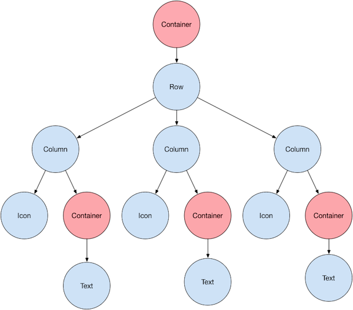
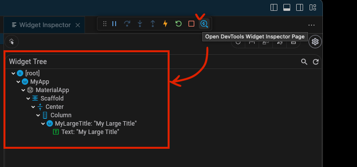
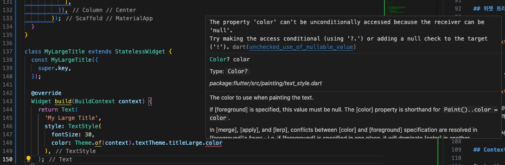

## BuildContext 란?  

BuildContext 란 뭘까? 
Stateless 위젯과 Statefull 위젯 모두 build 위젯 안에는 BuildContext 위젯이 존재한다.  

```dart
// Stateless Widget
class App extends StatelessWidget {
  const App({super.key});

  @override
  Widget build(BuildContext context) { // this!
    return MaterialApp(
      home: Scaffold(
...

// Statefule Widget
class _MyAppState extends State<MyApp> {
  List<int> numbers = [];

  void onClicked() {
    setState(() {
      numbers.add(numbers.length);
    });
  }

  @override
  Widget build(BuildContext context) { // this!
    return MaterialApp(
        home: Scaffold(
```

## 스타일시트

Flutter 는 앱의 모든 스타일을 한 곳에서 지정할 수 있는 기능을 제공한다.  
색상, 크기, 글자 굵기.. 등등  

가장 먼저 할 것은 MaterialApp에 theme을 지정해주는 것이다.  

```dart
class _MyAppState extends State<MyApp> {
  int counter = 0;

  void onClicked() {
    setState(() {
      counter += 1;
    });
  }

  @override
  Widget build(BuildContext context) {
    return MaterialApp(
        theme: ThemeData(                 // 대략 이렇게 사용한다.
          textTheme: TextTheme(           // 원하는 위젯의 테마를 설정해줄 수 있다.
            titleLarge: TextStyle(        // 이건 따로 한 번 보자
              color: Colors.red,
            ),
          ),
        ),
        home: Scaffold(
          backgroundColor: Color(0xFFF4EDDB),
          body: Center(
              child: Column(
            mainAxisAlignment: MainAxisAlignment.center,
            children: [
              MyLargeTitle(),
            ],
          )),
        ));
  }
}

class MyLargeTitle extends StatelessWidget { 
  const MyLargeTitle({
    super.key,
  });

  @override
  Widget build(BuildContext context) {
    return Text(
      'My Large Title',
      style: TextStyle(
        fontSize: 30,
      ),
    );
  }
}
```

## 위젯 트리  

Flutter가 애플리케이션을 어떻게 렌더링하는지 보여주는 그림이다.  



여기서 가장 root가 되는 container가 우리에게는 App 클래스가 된다.  

내가 만들고 있는 앱의 위젯 트리를 보려면 VScode에서 실행창의 Widget Inspector Page를 열면 된다.  



자 여기서 보여지는 것에 의하면 MyLargeTitle 위젯이 가장 상단 Root 즉 부모 클래스에 대한 정보에 접근하고자 한다.  
그러려면 무려 5단계를 지나가야 한다.  

그래서 여기서 이용할 것이 바로 context이다.  

## Context  

Context는 Text 이전에 있는 모든 상위 요소들에 대한 정보이다.  
그러므로 어떤 위젯에서 자신의 부모 위젯들의 정보에 접근하기 아주 편하게 해준다.  

그러면 위에서 보았던 위젯에서 MyLargeTitle 클래스가 자신의 부모 클래스에 정의된 스타일시트에서 정보를 불러오려면?  

```dart
class MyLargeTitle extends StatelessWidget { 
  const MyLargeTitle({
    super.key,
  });

  @override
  Widget build(BuildContext context) {
    return Text(
      'My Large Title',
      style: TextStyle(
        fontSize: 30,
        color: Theme.of(context).textTheme.titleLarge.color
      ),
    );
  }
}
```

이럴 때에는 Theme.of(context)를 통해 부모의 컨텍스트를 불러온 뒤,  
여기 있는 속성들을 불러오면 된다.  

Theme.of(context).textTheme.titleLarge.color 와 같이.  

하지만 무조건 불러올 수 있는 것은 아니다.  
위와 같이 코드를 작성했다면 아래와 같은 오류가 발생하는 것을 볼 수 있을 것이다.  

  

해석해보면 color property에 접근할 수 없다고 나오는데, 그 이유는 color 속성이 null 일 수 있기 때문이다.  

dart는 null safe 언어이기 때문에 null에 접근할 가능성을 차단해야 하는 것이다.  

이는 간단하게 설정해줄 수 있는데, color 값과 그 위의 titleLarge가 null 이 아니라는 것을 명시해주면 된다.  

```dart
class MyLargeTitle extends StatelessWidget { 
  const MyLargeTitle({
    super.key,
  });

  @override
  Widget build(BuildContext context) {
    return Text(
      'My Large Title',
      style: TextStyle(
        fontSize: 30,
        color: Theme.of(context).textTheme.titleLarge!.color // titleLarge에 ! 추가
        // color: Theme.of(context).textTheme.titleLarge?.color // 혹은 ? 를 추가해도 됨
      ),
    );
  }
}
```

