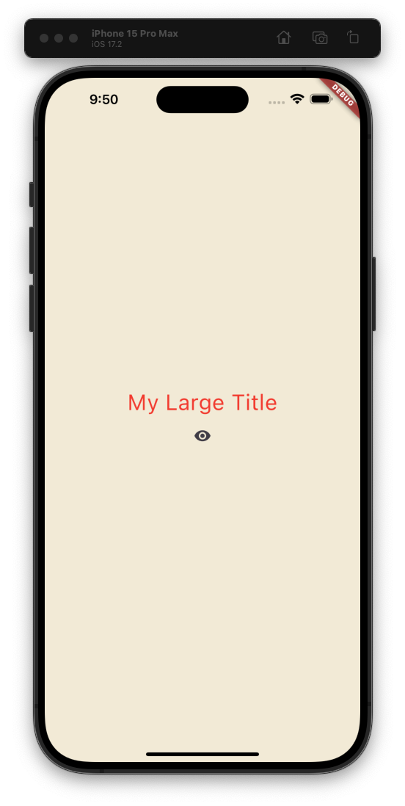

## Widget Lifecycle  

위젯은 살아있다.  

Statefule 위젯에는 생명주기가 있다.  

### 1.initState()  

이는 위젯을 초기화해주는 메서드이다. 하지만 이전에 실습에서 알 수 있듯이 우리는 이것을 사용하지 않았고, 사용하지 않더라도 앱이 정상적으로 빌드 되는 것을 알 수 있다. 즉, 이 메서드는 꼭 사용하지는 않아도 된다.  

```dart
class _MyAppState extends State<MyApp> {

  @override
  void initState() {    // initState
    super.initState();
  }
...
}
```

하지만 굳이 이렇게 사용하지 않고, property를 초기화해주는 것을 명시하는 것만으로도 이를 대체할 수 있다.  

```dart
class _MyAppState extends State<MyApp> {
  int counter = 0;
...
}
```

하지만 initState를 사용해야만 하는 경우가 있는데 (1) 데이터를 초기화하기 위해 context 를 이용할 때 (2) API 에서 업데이트를 subscribe 하고 싶을 때  

알아둬야 할 점은 (1) initState 는 build 메서드보다 앞서 사용되어야 한다는 점 (2) initState 는 오직 단 한 번 호출된다는 점  

==== initstate의 순서 ====

순서를 명시적으로 알아보기 위해 분리한 MyLargeTitleState에 아래처럼 print 문을 끼워넣어봤다.  

```dart
class MyLargeTitle extends StatefulWidget {
  const MyLargeTitle({
    super.key,
  });

  @override
  State<MyLargeTitle> createState() => _MyLargeTitleState();
}

class _MyLargeTitleState extends State<MyLargeTitle> {
  @override
  void initState() {
    // TODO: implement initState
    print('initState');
    super.initState();
  }

  @override
  Widget build(BuildContext context) {
    print('build');
    return Text(
      'My Large Title',
      style: TextStyle(
          fontSize: 30, color: Theme.of(context).textTheme.titleLarge?.color),
    );
  }
}
```

앱을 재실행시키면  

```bash
Restarted application in 379ms.
flutter: initState
flutter: build
```

initState가 먼저 실행되고, 이후 build가 실행됨을 볼 수 있다.  

### (2) dispose  

dispose 는 위젯이 스크린에서 제거될 떄 호출되는 메서드이다.  


이 dispose 메서드는 API 업데이트나 이벤트 리스너로부터 subscribe를 취소하거나 form 의 리스너로부터 벗어나고 싶을 때 사용할 수 있다. 무언가를 취소하는 것이다.  

```dart
class MyLargeTitle extends StatefulWidget {
  const MyLargeTitle({
    super.key,
  });

  @override
  State<MyLargeTitle> createState() => _MyLargeTitleState();
}

class _MyLargeTitleState extends State<MyLargeTitle> {
  @override
  void initState() {
    // TODO: implement initState
    print('initState');
    super.initState();
  }

  @override
  void dispose() {
    super.dispose();
    print('dispose');
  }

  @override
  Widget build(BuildContext context) {
    print('build');
    return Text(
      'My Large Title',
      style: TextStyle(
          fontSize: 30, color: Theme.of(context).textTheme.titleLarge?.color),
    );
  }
}


class _MyAppState extends State<MyApp> {
  int counter = 0;
  bool showTitle = true;

  void onClicked() {
    setState(() {
      counter += 1;
    });
  }

  void toggleTitle() {
    setState(() {
      showTitle = !showTitle;
      // showTitle == true ? showTitle = false : showTitle = true; // 이것과 같음
    });
  }

  @override
  Widget build(BuildContext context) {
    return MaterialApp(
        theme: ThemeData(
          textTheme: TextTheme(
            titleLarge: TextStyle(
              color: Colors.red,
            ),
          ),
        ),
        home: Scaffold(
          backgroundColor: Color(0xFFF4EDDB),
          body: Center(
              child: Column(
            mainAxisAlignment: MainAxisAlignment.center,
            children: [
              showTitle ? MyLargeTitle() : Text('nothing'),
              IconButton(
                onPressed: toggleTitle,
                icon: Icon(
                  Icons.remove_red_eye,
                ),
              )
            ],
          )),
        ));
  }
}
```

위와 같이 코드를 작성하면 아래와 같은 UI를 볼 수 있다.  



여기서 눈 모양을 누르면 MyLargeTitle은 사라지고 nothing 이라는 텍스트가 보여지게 된다.  
그리고 그 상태에서 한 번 더 누르면 nothing은 사라지고 MyLargeTitle이 보여지게 된다.  

그리고 MyLargeTitle이 초기화되고(initState) 빌드되고(build) 사라질 때 (dispose) 각각 상태를 출력하도록 해놨다.  

```bash
# 앱을 실행했을 때
flutter: initState
flutter: build
# 눈을 클릭했을 때
flutter: dispose
# 다시 눈을 클릭했을 때
flutter: initState
flutter: build
```


### 그 외  

앞서서 살펴봤던 initState, dispose 이외에도 build, setState 메서드 또한 stateful widget의 Life cycle 이다.  

createState : state 만들기  
initState : state 초기화  
build : 데이터를 통해 UI 빌드  
setState : 데이터가 변경되었을 때 새로고침  
dispose : 위젯이 제거될 때  
