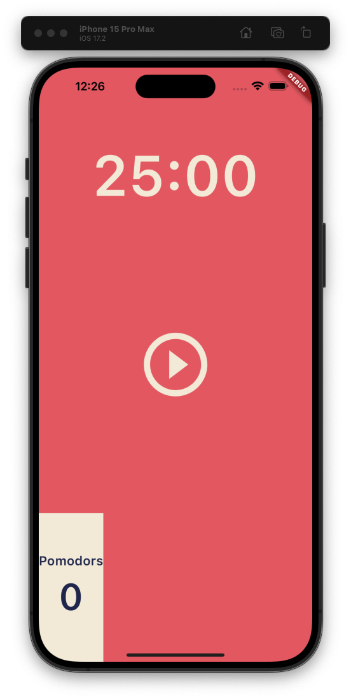
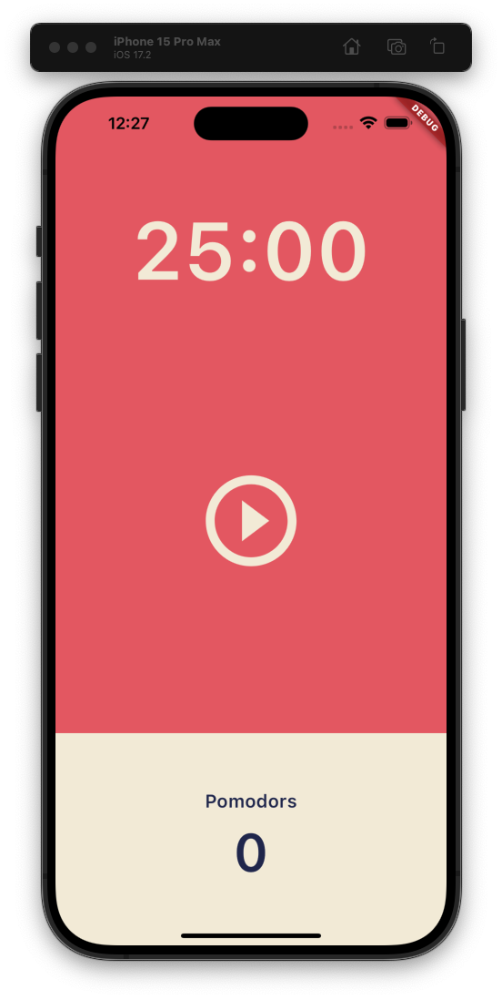

## Flexible 컴포넌트  

Column 위젯 아래 있는 컴포넌트  
하드 코딩되는 값을 만들게 해준다.  

예를 들어 기존에는 가로 200px 세로 100px 짜리 컴포넌트를 생성한다고 하면, 이 Flexible 컴포넌트는 화면 UI 비율에 기반해서 더욱 유연하게 컴포넌트를 만들 수 있다. 

### Flexible 컴포넌트 기본 사용법  

예를 들어 아래와 같은 코드가 있다고 해보자.  

```dart
class _MyWidgetState extends State<HomeScreen> {
  @override
  Widget build(BuildContext context) {
    return Scaffold(
      body: Column(
        children: [
          Flexible(
            child: Container(
              decoration: BoxDecoration(
                color: Colors.red,
              ),
            ),
          ),
          Flexible(
            child: Container(
              decoration: BoxDecoration(
                color: Colors.blue,
              ),
            ),
          ),
          Flexible(
            child: Container(
              decoration: BoxDecoration(
                color: Colors.green,
              ),
            ),
          ),
        ],
      ),
    );
  }
}
```

이 코드에는 세 개의 Flexible Container가 있다. 하지만 색상만 정의되어있을 뿐 그 크기나 범위는 정의되어있지 않다. 그저 Flexible에 쌓여 있을 뿐.  

하지만 이 코드로 나타나는 화면을 보면!  


Flexible은 화면 크기 및 비율에 맞춰 컴포넌트들을 유연하게 배치한다.  

### Flexible 컴포넌트 간 비율 정하기  

Flexible 컴포넌트 간 비율은 flex 라는 속성값으로 정의할 수 있다. flex 값은 int 형으로 적어주면 된다.  

```dart
class _MyWidgetState extends State<HomeScreen> {
  @override
  Widget build(BuildContext context) {
    return Scaffold(
      body: Column(
        children: [
          Flexible(
            flex: 1,
            child: Container(
              decoration: BoxDecoration(
                color: Colors.red,
              ),
            ),
          ),
          Flexible(
            flex: 2,
            child: Container(
              decoration: BoxDecoration(
                color: Colors.blue,
              ),
            ),
          ),
          Flexible(
            flex: 3,
            child: Container(
              decoration: BoxDecoration(
                color: Colors.green,
              ),
            ),
          ),
        ],
      ),
    );
  }
}

```


이렇게 되면, 화면을 세로로 6등분(1+2+3) 한 뒤, red에는 1만큼, blue에는 2만큼, green에는 3만큼 할당이 된다.  

### Flexible의 장점  

세상에는 다양한 스마트폰의 종류가 있고, 각각의 크기가 모두 다르기 때문에 컴포넌트를 픽셀로 정의해서 꾸미기에는 애로사항이 있을 수 있다.  

어떤 스마트폰에서는 컴포넌트의 크기가 지나치게 크고, 어떤 스마트폰에서는 컴포넌트의 크기가 너무 작을 수도 있다.  

하지만 Flexible 은 컴포넌트의 크기를 화면 크기에 맞춰 비율로 설정하기 때문에 이러한 애로사항을 해결할 수 있다.  


## Expended Widget  

특정 컴포넌트나 위젯을 가로 혹은 세로로 확장시켜주는 위젯.  

우선 예시 코드와 화면을 보자.  

```dart
Flexible(
    flex: 1,
    child: Row(
        children: [
        Container(
            decoration: BoxDecoration(
            color: Theme.of(context).cardColor,
            ),
            child: Column(
            mainAxisAlignment: MainAxisAlignment.center,
            children: [
                Text(
                'Pomodors',
                style: TextStyle(
                    fontSize: 20,
                    color: Theme.of(context).textTheme.headline1!.color,
                    fontWeight: FontWeight.w600,
                ),
                ),
                Text(
                '0',
                style: TextStyle(
                    fontSize: 58,
                    color: Theme.of(context).textTheme.headline1!.color,
                    fontWeight: FontWeight.w600,
                ),
                )
            ],
            ),
        ),
        ],
    ),
    ),
```  



아래쪽에 있는 Pomodors 텍스트가 있는 Row가 좀 이상하지 않나?  
이걸 가장 끝까지 확장시켜주기 위해 Extanded 위젯을 사용하면 아래와 같이 된다.  

```dart
Flexible(
flex: 1,
child: Row(
    children: [
    Expanded(
        child: Container(
        decoration: BoxDecoration(
            color: Theme.of(context).cardColor,
        ),
        child: Column(
            mainAxisAlignment: MainAxisAlignment.center,
            children: [
            Text(
                'Pomodors',
                style: TextStyle(
                fontSize: 20,
                color: Theme.of(context).textTheme.headline1!.color,
                fontWeight: FontWeight.w600,
                ),
            ),
            Text(
                '0',
                style: TextStyle(
                fontSize: 58,
                color: Theme.of(context).textTheme.headline1!.color,
                fontWeight: FontWeight.w600,
                ),
            )
            ],
        ),
        ),
    ),
    ],
),
),
```




## Timer 라이브러리  

Timer 라이브러리는 정해진 간격마다 한 번씩 함수를 반복 실행하도록 하는 툴이다.  

### periodic  

periodic 은 정해진 간격마다 한 번씩 함수를 반복 실행하도록 하는 메서드이다.  

기본적인 사용법은 아래와 같다.  

```dart
import 'dart:async'; // async 라이브러리 안에 있음

Timer timer = Timer.periodic(duration, (timer) { })
// duration : 반복하는 interval
// (timer) { } : 반복할 행위 / 메서드

```

시간을 1초씩 빼는 타이머를 만들어본다면 아래와 같이 할 수 있다.  

```dart
int seconds = 1500;

late Timer timer;

void onTick(Timer timer) {
setState(() {
    seconds = seconds - 1;
});
  }

void startTimer() {
    timer = Timer.periodic(
        Duration(seconds: 1),
        onTick,
    );
  }
```

여기서 주의할 점은 다음과 같다.  

-- Timer 안에 사용할 메서드 ((timer) { }) 에는 Timer 클래스가 파라미터로 들어가야 한다. `void onTick(Timer timer)` 처럼  
-- Timer.periodic 안에 들어가는 함수는 괄호가 없어야 한다. 저 때 실행되는 게 아니라 Timer가 포함된 메서드가 실행될 때 호출되어야 하기 때문이다.  


### cancel  

timer 를 멈추고 싶다면 cancel 메서드를 이용하면 된다.  

```dart
int seconds = 1500;
bool isRunning = false;
late Timer timer;

void onTick(Timer timer) {
setState(() {
    seconds = seconds - 1;
});
}

void startTimer() {
timer = Timer.periodic(
    Duration(seconds: 1),
    onTick,
);
setState(() {
    isRunning = !isRunning;
});
}

void pauseTimer() {
timer.cancel();  // 이렇게
setState(() {
    isRunning = !isRunning;
});
}
```


## Duration  

Duration 은 시간을 표현하기 위한 클래스이다.  

```dart

int seconds = 1500;
var duration = Duration(seconds: seconds);

print(duration);
// >> 0:25:00.000000

print(duration.toString());
// >> 0:25:00.000000

print(duration.toString().split('.'));
// >> [0:25:00, 000000]

print(duration.toString().split('.').first);
// >> 0:25:00

print(duration.toString().split('.').first.substring(2, 7));
// >> 25:00

```

