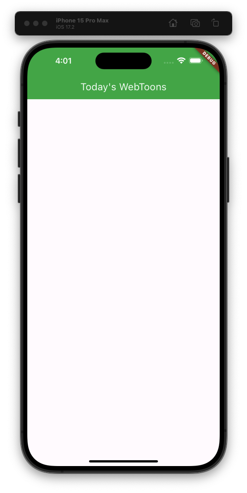

```dart
class MainApp extends StatelessWidget {
  const MainApp({super.key}); 
 ... 
}
```
이 위젯의 key를 stateless widget이라는 슈퍼클래스에 보내는 것  
즉 위젯은 ID 같은 식별자 역할을 하는 key가 있다는 것을 여기서 알 수 있다.  
이를 통해 flutter는 위젯을 빠르게 찾을 수 있다.  

## screens 폴더 만들기  

lib 하위에 screens 폴더를 만들 것이다.  
이 폴더에는 화면을 표시하는 여러 위젯 클래스를 넣어놓을 것이다.  

  

## AppBar  

AppBar 는 앱의 상단에 표시되는 제목바, 윈도우로 치면 여러 애플리케이션의 윈도우 네비게이션 바와 같은 부분이다.  

```dart
class HomeScreen extends StatelessWidget {
  const HomeScreen({super.key});

  @override
  Widget build(BuildContext context) {
    return Scaffold(
      appBar: AppBar(
        title: Text(
          "Today's WebToons",
        ),
        backgroundColor: Colors.green, // appBar 의 배경색
        foregroundColor: Colors.white, // appBar 의 전경색 (텍스트, 아이콘 등)
        elevation: 0, // 음영 색상 (0 : 없음)
      ),
    );
  }
}
```



