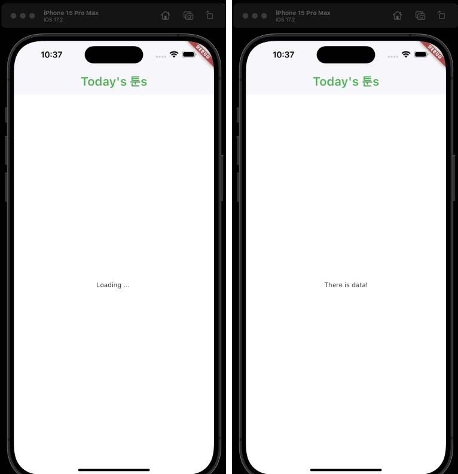

## Static 으로 만든다. 왜?  

여기서 getTodaysToons() 메서드와 ApiService 의 property 들을 static으로 바꿔줬다. state가 없기 때문이라고 했는데.. 왜지? 그게 무슨 말이지?  

```dart
import 'dart:convert';

import 'package:http/http.dart' as http;
import 'package:wetoon_app/models/webtoon_model.dart';

class ApiService {
  static const String baseUrl =
      "https://webtoon-crawler.nomadcoders.workers.dev";
  // 원래 final String baseUrl = "https://webtoon-crawler.nomadcoders.workers.dev";
  static const String today = "today";
  // 원래 final String today = "today";

  static Future<List<WebtoonModel>> getTodaysToons() async {
  // 원래 Future<List<WebtoonModel>> getTodaysToons() async {
    // async(비동기) 이기 때문에 반환값을 Future로 감싸줘야 함
    List<WebtoonModel> webtoonsInstances = [];
    final url = Uri.parse(baseUrl + "/" + today);
    final response = await http.get(url); // 요청에 대한 응답을 받아옴
    if (response.statusCode == 200) {
      // 요청 처리가 정상(200) 일 경우
      final List<dynamic> webtoons = jsonDecode(response.body);
      for (var webtoon in webtoons) {
        webtoonsInstances.add(
            WebtoonModel.fromJson(webtoon)); // WetoonModel 클래스로 정보를 받아 리스트에 넣어줌
      }
      return webtoonsInstances;
    }
    throw Error(); // 요청 처리가 정상이 아닐 경우 Error를 발생시킨다.
  }
}
```


```dart
void main() {
  runApp(const MainApp());
  ApiService().getTodaysToons(); // 여기 getTodaysToons() 에 빨간줄
}

// 아래는 오류 내용

The static method 'getTodaysToons' can't be accessed through an instance.
Try using the class 'ApiService' to access the method.dartinstance_access_to_static_member
Future<List<WebtoonModel>> getTodaysToons()
Type: Future<List<WebtoonModel>> Function()

package:wetoon_app/services/api_service.dart
```


## Flutter에서 Future데이터를 불러와서 보여주는 두 가지 방법  

### 첫 번째 방법 fetch data 그리고 state에 넣기   

아래와 같이 데이터를 띄울 HomeScreen에 InitState를 만들고, 여기에 API 데이터를 받아오는 waitForWebToons 메서드를 만들어서 넣어준다.  

좀 더 쉽게 해석하자면, 앱의 홈 UI를 담당한 본 HomeScreen이 초기화 될 때 (initState) API에서 정보를 받아오고, isLoading 플래그를 바꿔주는 것이다.  

```dart
class _HomeScreenState extends State<HomeScreen> {
  List<WebtoonModel> webtoons = []; // 웹툰 정보들을 담아둘 리스트
  bool isLoading = true; // ?

  void waitForWebToons() async {
    // 웹툰 정보를 가져오는 함수. getTodaysToons 서비스가 비동기이기 때문에 이 함수도 비동기로 선언해줘야 한다. ★★★★★
    webtoons = await ApiService.getTodaysToons();  // API로 받아오는 웹툰 정보
    isLoading = false;                             // isLoading flag
    setState(() {});  // 변경된 데이터를 적용해 새로고침
  }

  @override
  void initState() {
    super.initState();
    waitForWebToons();
  }

  @override
  Widget build(BuildContext context) {
    print(webtoons);    // initState 테스트
    print(isLoading);   // initState 테스트
    return Scaffold(
      backgroundColor: Colors.white,
      appBar: AppBar(
        elevation: 1, // 음영 색상 (0 : 없음)
        title: Text(
          "Today's 툰s",
          style: TextStyle(
            fontSize: 26,
            fontWeight: FontWeight.w600,
          ),
        ),
        backgroundColor: Colors.white, // appBar 의 배경색
        foregroundColor: Colors.green, // appBar 의 전경색 (텍스트, 아이콘 등)
      ),
    );
  }
}
```

그리고 이 상태의 앱 내부에서 어떤 동작이 일어나는지 알아보기 위해 build 메서드 안에 webtoos와 isLoading 플래그를 출력하게끔 해보았고, 아래는 출력문이다.  

```bash
Restarted application in 255ms.

flutter: []
flutter: true

flutter: [Instance of 'WebtoonModel', Instance of 'WebtoonModel', Instance of 'WebtoonModel', Instance of 'WebtoonModel', Instance of 'WebtoonModel', Instance of 'WebtoonModel', Instance of 'WebtoonModel', Instance of 'WebtoonModel', Instance of 'WebtoonModel', ... ]
flutter: false
```

보다시피 처음에는 웹툰 정보가 비어있었고, flag도 초기값과 같이 true이지만, 새로고침을 하게 되면서 webtoons에는 웹툰의 정보가 담기고 flag 도 flase로 바뀐 것을 볼 수 있다.  

즉 실행 순서가 이렇게 된 것이다.  

|순서|작업1|작업2|
|---|---|---|
|1|build가 실행됨||
|2|initState가 실행됨. waitForWebToons메서드가 실행됨||
|3|print문이 실행됨|waitForWebToons메서드가 실행되어 정보를 받아옴, flag를 변경함|
|4||데이터가 변경되었기 때문에 setState()가 실행됨|
|5|다시 build가 실행됨||
|6|다시 print문이 실행됨||

이 예시를 통해 Flutter에서 비동기처리가 어떤 순서로 처리되는지를 알 수 있다.  


### 두 번째 방법 Future Builder   

위 방식도 정석적이고 좋은 방식이지만, 권장되지는 않는다. 왜냐하면 State가 그렇게 많이 쓰이지 않기 때문이다. (보편적인 방법이 아님) State를 전혀 쓰지 않는 좋은 Widget과 Framework가 많이 있어서 굳이 사용할 필요가 없음.  

Future Builder 방식은 좋은 점이 있는데, 바로 StatelessWidget 상태에서도 사용할 수 있다는 점이다. 굳이 StatefulWidget을 사용하지 않아도 된다.  

방법은 아래와 같다.  

```dart
class HomeScreen extends StatelessWidget {
  HomeScreen({super.key});

  // Future 변수를 API Service로부터 바로 받는다.
  Future<List<WebtoonModel>> webtoons = ApiService.getTodaysToons();

  @override
  Widget build(BuildContext context) {
    return Scaffold(
        backgroundColor: Colors.white,
        appBar: AppBar(
          elevation: 1,
          title: Text(
            "Today's 툰s",
            style: TextStyle(
              fontSize: 26,
              fontWeight: FontWeight.w600,
            ),
          ),
          backgroundColor: Colors.white,
          foregroundColor: Colors.green,
        ),
        body: FutureBuilder(
          future: webtoons,
          builder: (context, snapshot) {  // future builder
            if (snapshot.hasData) {  // snapshot에 데이터가 있으면
              return Center(child: Text(snapshot.data.toString()));
            } else {  // snapshot에 데이터가 없으면
              return Center(child: Text('Loading ... '));
            }
            // return Text("");
          },
        ));
  }
}
```

위와 같이 StatelessWidget에 비동기 함수를 사용할 수 있다!  
위 예시에서는 우선 Text(snapshot.data.toString()) 으로 받아온 데이터를 String 형태로만 받아오지만, 이후 진행에 따라 이것을 이미지 등 컨텐츠화 할 테니 우선은 개념적으로만 봐두자.  

그런데 어떻게 API 응답을 받는 것을 알고, 데이터가 변경되면 setState와 같이 새로고침을 해줄 수 있을까? 위 코드에서는 그러한 작동을 할 게 아무것도 보이지 않는데..  


### Future Builder 돌아보기  

```dart
// FutureBuilder에 대한 설명  
(new) FutureBuilder<dynamic> FutureBuilder({
  Key? key,
  required Future<dynamic>? future,
  dynamic initialData,
  required Widget Function(BuildContext, AsyncSnapshot<dynamic>) builder,
})
package:flutter/src/widgets/async.dart

Creates a widget that builds itself based on the latest snapshot of interaction with a [Future].
```

-- Future<dynamic> 타입의 future 가 파라미터로 요구된다.★  
-- Widget Function 형태의 builder라는 파라미터가 요구된다.  
-- initialData 를 넣을 수 있다.  

```dart
// future 파라미터에 대하여  
{required Future<dynamic>? future}
Type: Future<dynamic>?

The asynchronous computation to which this builder is currently connected, possibly null.

If no future has yet completed, including in the case where [future] is null, the data provided to the [builder] will be set to [initialData].
```

-- future 파라미터는 Future<dynamic> 데이터타입이다.  

```dart
// builder 파라미터에 대하여
{required Widget Function(BuildContext, AsyncSnapshot<dynamic>) builder}
Type: Widget Function(BuildContext, AsyncSnapshot<dynamic>)

The build strategy currently used by this builder.

The builder is provided with an [AsyncSnapshot] object whose [AsyncSnapshot.connectionState] property will be one of the following values:

[ConnectionState.none]: [future] is null. The [AsyncSnapshot.data] will be set to [initialData], unless a future has previously completed, in which case the previous result persists.

[ConnectionState.waiting]: [future] is not null, but has not yet completed. The [AsyncSnapshot.data] will be set to [initialData], unless a future has previously completed, in which case the previous result persists.

[ConnectionState.done]: [future] is not null, and has completed. If the future completed successfully, the [AsyncSnapshot.data] will be set to the value to which the future completed. If it completed with an error, [AsyncSnapshot.hasError] will be true and [AsyncSnapshot.error] will be set to the error object.

This builder must only return a widget and should not have any side effects as it may be called multiple times.
```

builder는 (BuilderContext, AsyncSnapshot<dynamic>) 형식의 input이 필요하다.  

builder는 알다시피 UI를 그려주는 함수다. 

BuilderContext에는 context 를 넣어 부모 위젯의 정보를 받아올 수 있게 한다.  

그리고 AsyncSnapshot에는 snapshot을 넣어주게 된다. 이 snapshot을 이용하면 앞서 future 파라미터에 넣어준 Future 자료형의 변수의 상태(state)를 알 수 있다.  

snapshot은 하위 메서드를 가지고 있는데, 아래와 같다.  

```dart
snapshot.hasdata : snapshot이 데이터를 가지고 있는지 bool 반환
snapshot.haserror : snapshot이 error를 가지고 있는지 bool 반환

snapshot.connectionState : Future의 연결 상태를 반환?
snapshot.data : Future 관련한 데이터를 반환?
snapshot.error : Future 관련한 오류를 반환?
```

즉 아래 코드에서 snapshot은 Future<List<WebtoonModel>> 데이터형인 webtoons 데이터에 대해 값을 받아서 오는 것에 대해 기다려주고, 이와 관련된 상태, 데이터, 오류를 알 수 있게 해주는 것이다.  

이를 단적으로 잘 볼 수 있도록 테스트 해보자면  

```dart
class HomeScreen extends StatelessWidget {
  HomeScreen({super.key});
  Future<List<WebtoonModel>> webtoons = ApiService.getTodaysToons();

  @override
  Widget build(BuildContext context) {
    return Scaffold(
        backgroundColor: Colors.white,
        appBar: AppBar(
          elevation: 1,
          title: Text(
            "Today's 툰s",
            style: TextStyle(
              fontSize: 26,
              fontWeight: FontWeight.w600,
            ),
          ),
          backgroundColor: Colors.white,
          foregroundColor: Colors.green,
        ),
        body: FutureBuilder(  // future builder
          future: webtoons,
          builder: (context, snapshot) {
            if (snapshot.hasData) {  // snapshot에 데이터가 있으면
              return Center(child: Text("There is data!"));
            } else {  // snapshot에 데이터가 없으면
              return Center(child: Text('Loading ... '));
            }
          },
        ));
  }
}
```




위와 같은 순서로 화면이 나타나게 된다.  
즉, 처음 로딩시에는 데이터가 없기 때문에 Loading ... 이 발생하다가 데이터가 들어오면 이를 캐치해서 There is data! 를 출력하는 것이다.  

정말 편리하다. await, async 와 같은 키워드나 setState도 쓸 필요가 없는 것이다!  

