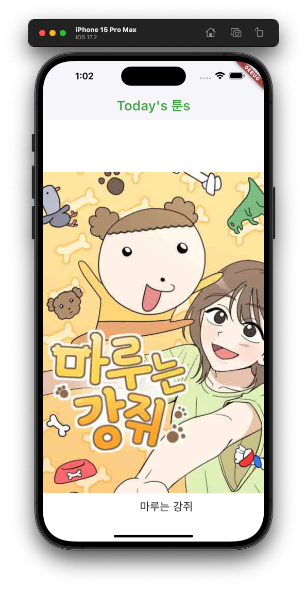

## 분리  

가독성을 위해 ListView위젯을 분리해줬다. 아래와 같이.  

```dart
class HomeScreen extends StatelessWidget {
  HomeScreen({super.key});
  // const HomeScreen({super.key}); // const 를 지워줘야 한다.
  // const는 컴파일 전에 값을 알고 있다는 뜻이기 때문에 컴파일 전에 값을 알 수 없는 Future값이 클래스 내에 있으면 const는 사용할 수 없다.

  // Future 변수를 API Service로부터 바로 받는다.
  Future<List<WebtoonModel>> webtoons = ApiService.getTodaysToons();

  @override
  Widget build(BuildContext context) {
    return Scaffold(
      backgroundColor: Colors.white,
      appBar: AppBar(
        elevation: 1, // 음영 색상 (0 : 없음)
        title: Text(
          "Today's 툰s",
          style: TextStyle(
            fontSize: 26,
            fontWeight: FontWeight.w600,
          ),
        ),
        backgroundColor: Colors.white, // appBar 의 배경색
        foregroundColor: Colors.green, // appBar 의 전경색 (텍스트, 아이콘 등)
      ),
      body: FutureBuilder(
        future: webtoons,
        builder: (context, snapshot) {
          // future builder
          if (snapshot.hasData) {
            // snapshot에 데이터가 있으면
            return Column(
              children: [
                SizedBox(
                  height: 100,
                ),
                Expanded(child: makeList(snapshot)), // Expanded
              ],
            );
          } else {
            // snapshot에 데이터가 없으면
            return Center(child: CircularProgressIndicator());
          }
        },
      ),
    );
  }

  ListView makeList(AsyncSnapshot<List<WebtoonModel>> snapshot) {
    return ListView.separated(
      // 리스트뷰 빌더 / 세퍼레이터
      scrollDirection: Axis.horizontal, // 스크롤
      itemCount: snapshot.data!.length, // 아이템카운트
      itemBuilder: (context, index) {
        // 아이템빌더
        var webtoon = snapshot.data![index]; // 빌드할 아이템 선택
        return Column(children: [Text(webtoon.title)]); // 아이템을 텍스트로 나타내준다.
      },
      separatorBuilder: (context, index) => SizedBox(
        width: 40,
      ),
    );
  }
}
```


## Expanded  

공간을 미리 잡아두는, 즉 공간을 미리 예약해두는 것이다.  

앱을 만들다 보면 아래와 같은 오류를 만날 떄가 있다.  

```bash
════════ Exception caught by rendering library ═════════════════════════════════
RenderBox was not laid out: RenderViewport#fa404 NEEDS-PAINT
'package:flutter/src/rendering/box.dart':
Failed assertion: line 1972 pos 12: 'hasSize'
The relevant error-causing widget was:
════════════════════════════════════════════════════════════════════════════════
```

이것은 빌드하려는 위젯의 크기가 정해지지 않았기 때문에 나타나는 오류이다.  

이것을 방지하기 위해서 Expand 위젯을 사용해주면 된다.  

사용법은 간단하다. 공간을 미리 잡아놓을 위젯을 Expended 위젯으로 감싸주면 된다.  

```dart
Expanded(child: makeList(snapshot)), // Expanded
```


## Image 위젯  

Image 위젯은 flutter가 제공하는 기본 위젯으로, 이미지를 나타내주는 위젯이다.  

### Image.network  

URL을 통해 이미지를 빌드하는 메서드이다. 파라미터로는 URL을 받는다.  

```dart
ListView makeList(AsyncSnapshot<List<WebtoonModel>> snapshot) {
    return ListView.separated(
      scrollDirection: Axis.horizontal,
      itemCount: snapshot.data!.length,
      itemBuilder: (context, index) {
        var webtoon = snapshot.data![index];
        return Column(children: [
          Image.network(
            // Image.networdk
            webtoon.thumb,
            headers: const {
              // 헤더를 추가하여 200 통신을 할 수 있도록 함
              "User-Agent":
                  "Mozilla/5.0 (Macintosh; Intel Mac OS X 10_15_7) AppleWebKit/537.36 (KHTML, like Gecko) Chrome/110.0.0.0 Safari/537.36",
            },
          ),
          Text(
              webtoon.title,
              style: TextStyle(
                fontSize: 22,
              ),
          ),
        ]);
      },
      separatorBuilder: (context, index) => SizedBox(
        width: 40,
      ),
    );
  }
```



### 이미지 크기 조절하기  

이미지 크기를 조절하기 위해서는 Container 안에 이미지 위젯을 넣어주면 된다.  

```dart
ListView makeList(AsyncSnapshot<List<WebtoonModel>> snapshot) {
    return ListView.separated(
      scrollDirection: Axis.horizontal,
      itemCount: snapshot.data!.length,
      itemBuilder: (context, index) {
        var webtoon = snapshot.data![index];
        return Column(children: [
          Container(      // container로 이미지를 감싸줌
            width: 250,   // 가로 크기는 250
            child: Image.network(
            webtoon.thumb,
            headers: const {
              "User-Agent":
                  "Mozilla/5.0 (Macintosh; Intel Mac OS X 10_15_7) AppleWebKit/537.36 (KHTML, like Gecko) Chrome/110.0.0.0 Safari/537.36",
            },
          ),
          Text(
              webtoon.title,
              style: TextStyle(
                fontSize: 22,
              ),
            ),
          ),
        ],
        );
      },
      separatorBuilder: (context, index) => SizedBox(
        width: 40,
      ),
    );
  }
```


## 참고  

shadow, 색상 등은 우선 눈에 띄는 색상으로 만든 뒤 (예를 들면 빨간색) 그 다음 예쁘게 만들어주는 것을 추천한다. 왜냐하면 눈에 띄어야 크기를 조절하기 쉽고, 크기를 조절한 다음 예쁘게 만드는 게 전체적인 작업에서 쉽기 때문이다. 