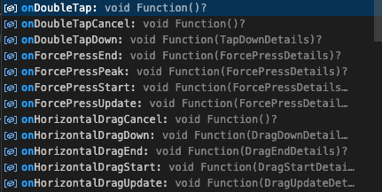

## 탭 이벤트 감지  

탭을 할 경우 사용자를 그 페이지로 보내는 것  

GestureDetector 를 사용할 것이다.  

```dart
Column(
      children: [
        Container(
          width: 250,
          clipBehavior: Clip.hardEdge, // 모서리를 튀어나오는 부분은 깔끔하게(hard) 제거
          decoration: BoxDecoration(
            // 박스 데코레이션
            borderRadius: BorderRadius.circular(15), // 모서리 둥글게 처리
            boxShadow: [
              // 그림자 설정
              BoxShadow(
                blurRadius: 13,
                offset: Offset(7, 7),
                color: Colors.black.withOpacity(0.3),
              )
            ],
          ),
          child: Image.network(
            // Image.networdk
            thumb,
            headers: const {
              // 헤더를 추가하여 200 통신을 할 수 있도록 함
              "User-Agent":
                  "Mozilla/5.0 (Macintosh; Intel Mac OS X 10_15_7) AppleWebKit/537.36 (KHTML, like Gecko) Chrome/110.0.0.0 Safari/537.36",
            },
          ),
        ),
        SizedBox(
          height: 13,
        ),
        Text(
          title,
          style: TextStyle(
            fontSize: 22,
          ),
        ),
      ],
    ); // 아이템을 텍스트로 나타내준다.;
```

원래 코드가 위와 같았다.  

```dart
GestureDetector(
    onTap : 탭할 때의 액션,
    onTapDown : 탭해서 손가락을 내릴 때 액션,
    onTapUp : 탭해서 손가락을 올릴 때 액션,
    child : 표현할 차일드
)
```

gesturedetector가 감지하는 제스처는 여러 가지가 있다.  

위에서 봤듯이 탭을 하는 동작 뿐 아니라  

마우스, 줌, 더블탭, 세게 누르기, 길게 누르기.. 등

