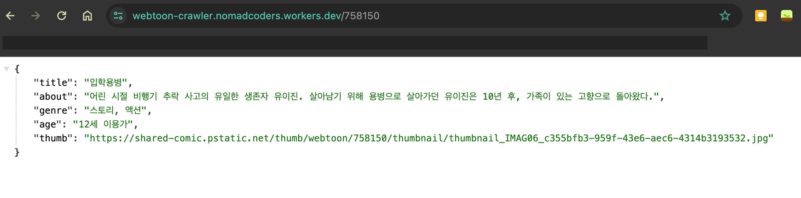

## 개발 과정  

### Webtoon detail 모델 과 api 서비스 만들기  

웹툰 디테일 모델에 해당하는 webtoonDetailModel.dart 파일을 model 폴더에 만들어준다. 이 모델은 객체를 담당하게 될 것이다.  

이 모델은 웹툰의 detail page 를 담당하는 모델이 될텐데, detail page api는 아래와 같은 자료형을 다룰 수 있게 구성되어야 한다.  



```dart
class WebtoonDetailModel {
  final String title, about, genre, age;

  WebtoonDetailModel.fromJson(Map<String, dynamic> json)
      : title = json['title'],
        about = json['about'],
        genre = json['genre'],
        age = json['age'];
}
```

그리고 난 뒤 api service dart 에 detail에 대한 내용을 받는 api 서비스를 등록해준다.  

```dart
static Future<WebtoonDetailModel> getToonById(String id) async {
    final url = Uri.parse(baseUrl + "/" + id);
    final response = await http.get(url); // 요청에 대한 응답을 받아옴
    if (response.statusCode == 200) {
      final webtoon = jsonDecode(response.body);
      return WebtoonDetailModel.fromJson(webtoon);
    }
    throw Error();
  }
```

설명을 해보자면 이 api 서비스의 이름은 getToonById 이다.  
그리고 외부에 요청을 받고 기다려야 하는 비동기 서비스이므로 async와 await를 사용해준다.  

response 라는 var 자료형으로 응답을 받은 다음, 이를 json 형태로 decode 한다.  
그리고 이렇게 디코딩한 자료를 WebtoonDetailModel 객체를 만드는 것으로 반환한다.  

### webtoon episode 모델과 api 서비스 만들기  

이어서 /id/episodes 를 받아오는 api 또한 작성한다.  

이 api는 아래와 같은 자료형을 다뤄야 한다.  


이 자료형을 보면 우선 list 형태이고, 각 원소는 thumb, id, title, rating, date 라는 String 형태의 자료를 담고 있다.  

그러면 이에 맞는 모델을 만들어준다.  

```dart
// webtoon_episode_model.dart  

class WebtoonEpisodeModel {
  final String id, title, rating, date;

  WebtoonEpisodeModel.fromJson(Map<String, dynamic> json)
      : id = json['id'],
        title = json['title'],
        rating = json['rating'],
        date = json['date'];
}

```

단, 썸네일은 사용하지 않을 거라 제외한다. 왜재?  

이어서 이 자료를 받아올 api도 만들어준다.  

```dart
// api_service.dart
static Future<List<WebtoonEpisodeModel>> getLatestEpisodesById(
      String id) async {
    List<WebtoonEpisodeModel> episodesInstance = [];
    final url = Uri.parse(baseUrl + "/" + id + "/episodes");
    final response = await http.get(url); // 요청에 대한 응답을 받아옴
    if (response.statusCode == 200) {
      final episodes = jsonDecode(response.body);
      for (var episode in episodes) {
        episodesInstance.add(WebtoonEpisodeModel.fromJson(episode));
      }
      return episodesInstance;
    }
    throw Error();
  }
```

### Detail 페이지에 적용하기  

이제 detail page 에 적용을 할 차례다.  

작업은 detail_screen.dart 에서 이루어질 것인데, 우선 이 위젯을 stateless에서 stateful로 만들어줄 것이다. 이렇게 하는 이유는 아래에서 살펴보겠다.  

우선 원래의 detail_scree.dart는 아래와 같이 생겼다.  

```dart
//  detail_screen.dart
class DetailScreen extends StatelessWidget {
  final String id, title, thumb;

  const DetailScreen({
    super.key,
    required this.id,
    required this.title,
    required this.thumb,
  });

  @override
  Widget build(BuildContext context) {
    return Scaffold(
        backgroundColor: Colors.white,
        appBar: AppBar(
        elevation: 1, // 음영 색상 (0 : 없음)
        title: Text(
          title,
          style: TextStyle(
            fontSize: 26,
            fontWeight: FontWeight.w600,
          ),
        ),
  ...
```

이제 여기에 webtoon detail 클래스인 자료형을 받아올 것이다.  
그래서 Detail Screen의 property 적용부에 weobtoon detail 클래스를 선언을 해주면 ..

```dart
//  detail_screen.dart
class DetailScreen extends StatelessWidget {
  final String id, title, thumb;

  Future<WebtoonDetailModel> webtoon = ApiService.getToonById(id); // 여기

  const DetailScreen({
    super.key,
    required this.id,
    required this.title,
    required this.thumb,
  });

  @override
  Widget build(BuildContext context) {
    return Scaffold(
        backgroundColor: Colors.white,
        appBar: AppBar(
        elevation: 1, // 음영 색상 (0 : 없음)
        title: Text(
          title,
          style: TextStyle(
            fontSize: 26,
            fontWeight: FontWeight.w600,
          ),
        ),
  ...
```

오류가 발생하게 된다. 왜냐면 webtoon property를 만들 때 다른 Property인 id에 접근할 수가 없기 때문이다. 이들은 동일선상에 있는 property로, 함께 초기화되기 때문에 서로에게 접근을 할 수 없다.  

그래서 이를 stateful widget으로 바꿔줘야 한다.  

stateful widget으로 바꿔주면 변화가 생긴다. 바로 stateless widget일 때에는 바로 접근했던 title, id, thumb property를 사용하는 곳의 앞에 widget이라는 클래스가 붙어있는 것을 볼 수 있다.  

```dart
//  detail_screen.dart

class DetailScreen extends StatefulWidget {
  final String id, title, thumb;


  const DetailScreen({
    super.key,
    required this.id,
    required this.title,
    required this.thumb,
  });

  @override
  State<DetailScreen> createState() => _DetailScreenState();
}

class _DetailScreenState extends State<DetailScreen> {
  Future<WebtoonDetailModel> webtoon = ApiService.getToonById(widget.id);  // 여기

  @override
  Widget build(BuildContext context) {
    return Scaffold(
      backgroundColor: Colors.white,
      appBar: AppBar(
        elevation: 1,
        title: Text(
          widget.title,       // 여기
          style: TextStyle(
            fontSize: 26,
            fontWeight: FontWeight.w600,
          ),
        ),
        backgroundColor: Colors.white,
        foregroundColor: Colors.green,
      ...
```

이 이유는 기존 위젯이 stateful 위젯으로 바뀌면서 위젯 자체인 DetailScreen 클래스(stateful 위젯)와 해당 위젯의 상태(state)를 담고 있는 _DetailScreenState로 나눠졌기 때문이다.  

서로 다른 클래스이므로, 어떤 Property를 찾기 위해서는 그것을 찾는 위치, 클래스를 명시해줘야 하기 때문에 widget.이 붙게 되는 것이다.  

즉 아래와 같이 정리할 수 있다.  

```dart
- stateful 위젯은 두 가지 클래스로 이루어진다.  
- 첫 번째는 위젯 자체를 나타내는 stateful widget이다.  
- 두 번째는 해당 위젯의 상태를 나타내는 state이다.(_클래스명State 로 표현된다.)  
- state에서 위젯에 있는 property 등에 접근하기 위해서는 widget.프로퍼티명 식으로 가져올 수 있다.  
```

이를 이용해 WebtoonDetailModel이 id값을 가져와 사용할 수 있게 만들려면 아래와 같이 된다.  

```dart
//  detail_screen.dart

class DetailScreen extends StatefulWidget {
  final String id, title, thumb;

  const DetailScreen({
    super.key,
    required this.id,
    required this.title,
    required this.thumb,
  });

  @override
  State<DetailScreen> createState() => _DetailScreenState();
}

class _DetailScreenState extends State<DetailScreen> {
  late Future<WebtoonDetailModel> webtoon; // webtoon을 late 선언해주고

  @override
  void initState() {  // iniState를 만들고
    super.initState(); // initState는 
    webtoon = ApiService.getToonById(widget.id); // webtoon 객체를 초기화한다.
  }
  ...
```

그리고 여기에 더해 episodesmodel도 추가해주겠다.  

```dart
//  detail_screen.dart
class _DetailScreenState extends State<DetailScreen> {
  late Future<WebtoonDetailModel> webtoon;
  late Future<List<WebtoonEpisodeModel>> episodes;

  @override
  void initState() {
    super.initState();
    webtoon = ApiService.getToonById(widget.id);
    episodes = ApiService.getLatestEpisodesById(widget.id);
  }
  ...
```


이곳에서 일어난 일을 정리해보면  

1. detailScreen 위젯 내에서 WebtoonDetailModel 클래스 객체를 property로 가지게끔 하고 싶다.  
2. 이 WebtoonDetailModel 클래스는 id 라는 파라미터를 필요로 한다.  
3. id는 detailScreen 내에서 선언하려 하는 WebtoonDetailModel property와 동일위치에 있는 property이다.  
4. 이렇게 동일 위치에 있는 property 간에는 서로 가져올 수 없다. 초기화되는 시점이 동일하기 때문이다.  
5. 이를 해결하기 위해서는 detailScreen 위젯을 stateful 위젯으로 바꾸고  
6. stateful 위젯 안쪽에 WebtoonDetailModel에 해당하는 객체를 late로 선언해준다.  
7. 그리고 이 객체는 initState 안쪽에서 초기화해준다. (initState가 없다면 만들어준다.)  
