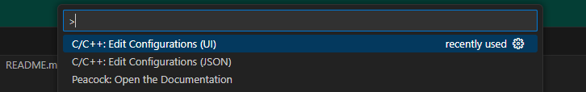
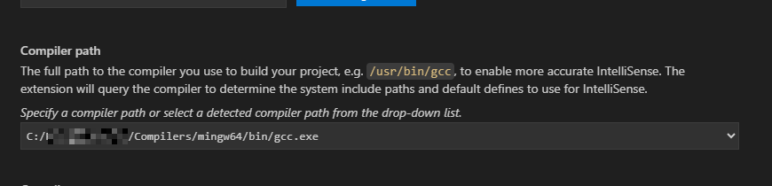
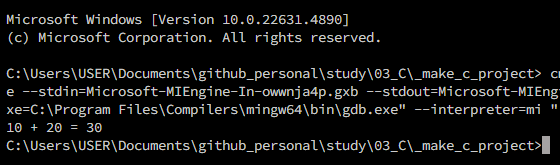

## Trouble Shooting  

### 현상  

- VSCode 에서 C 컴파일시 아래 에러 발생  

```bash
cl.exe build and debug active file is only usable when VS Code is run from the Developer Command Prompt for VS.
```

### 원인  

- VSCode에서 cl.exe(MSVC 컴파일러)를 사용하려고 할 때 Visual Studio의 Developer Command Prompt 환경이 잡혀있지 않기 때문  
- MSVC 컴파일러(cl.exe)는 일반 터미널에서 바로 사용할 수 없고, Visual Studio에서 제공하는 Developer Command Prompt 나 x64 Native Tools Command Prompt에서만 사용이 가능하다. (이 환경에서만 `INCLUDE`, `LIB`, `PATH` 등이 자동으로 설정되기 때문)  
- 쉽게 말해, VSCode 에서 사용하려고 하는 컴파일러가 Visual Studio IDE에 맞춰져 있다 보니, VSCode에서 바로 사용할 수가 없는 상황  

### 해결 방안  

- (1) Developer Command Prompt에서 VS Code를 실행  
- (2) VS Code에 MSVC 환경 설정하기  
- (3) GCC (컴파일러) 사용 : VS Code와 바로 연결 가능 ★ 선택  

### 해결  

- GCC 설치 : [https://winlibs.com/#download-release](https://winlibs.com/#download-release)  
- 다운받은 압축파일을 적절한 곳(잘 삭제하지 않을 곳)에 압축 풀기  
- 압축 푼 폴더 내 bin 경로를 환경변수 Path에 등록  



- VS Code를 기동하고, 팔레트에서 `C/C++:Edit Configurations (UI)` 선택  



- 세팅창에서 컴파일러를 GCC로 선택 (관련해서 추가적인 설정이 필요할 수 있으며, 눈치껏 설정하면 된다.)  



- 성공!  


