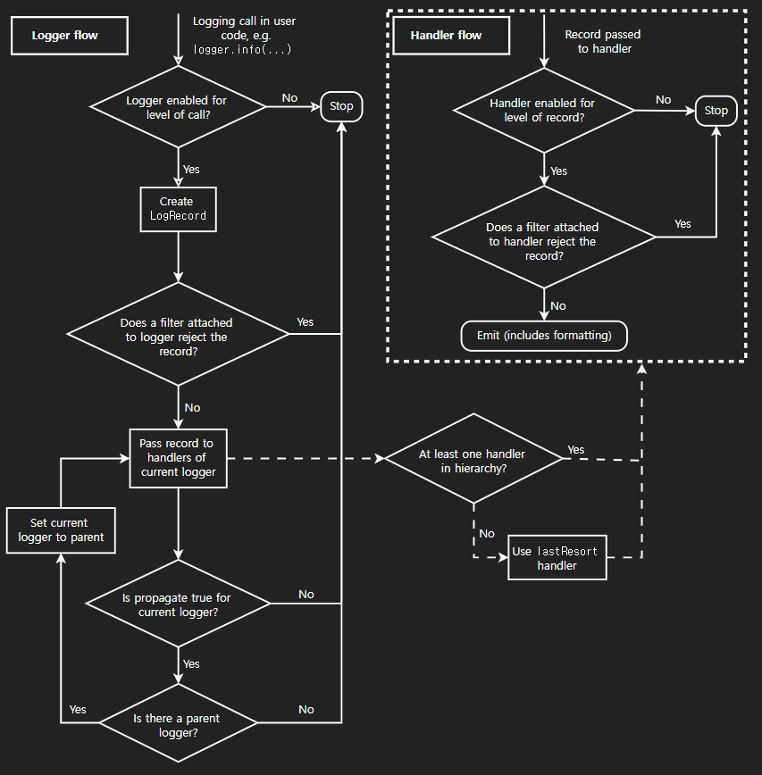

## logging  

### 정의  


### 소스코드  

```python
# Lib/logging/__init__.py
```


### getLogger  

#### 사용법  

- 가장 처음 만나는 함수가 바로 `getLogger(name)` 이다. 
- `getLogger()` 메서드의 인자는 `name` 이다.  
- 이 `name` 은 로그 메시지의 두 번째에 등장한다.  

```bash
[LOG_LEVEL]:[LOGGER_NAME]:[LOG_MESSAGE]
```

- 이 함수는 `Logger.manager.getLogger(name)` 의 결과를 리턴한다.  

```python
def getLogger(name=None):
    """
    Return a logger with the specified name, creating it if necessary.
    If no name is specified, return the root logger.
    """
    if not name or isinstance(name, str) and name == root.name:
        return root
    return Logger.manager.getLogger(name)
```

### logging.basicConfig  

#### 정의  

- 로깅의 기본적인 설정을 정의한다.  

#### 사용법  

```python
logging.basicConfig(filename="myapp.log",
                    level=logging.INFO,
                    encoding='utf-8',
                    filemode=,
                    format=,
                    datefmt=,
                    style=,
                    stream=,
                    handlers=,
                    force=,
                    errors=)
```


|**인자 (Parameter)**|**설명 (Description)**|**추가 참고 (Notes)**|
|---|---|---|
|`filename`|로그를 출력할 파일의 경로를 지정합니다.|이 인자를 사용하면 콘솔(`StreamHandler`) 대신 파일(`FileHandler`)에 로그가 저장됩니다.|
|`filemode`|`filename`으로 파일을 열 때 사용할 모드를 지정합니다.|기본값은 `'a'` (append, 이어쓰기)입니다. 덮어쓰려면 `'w'` (write)를 사용합니다.|
|`format`|로그 메시지의 출력 형식을 지정하는 문자열입니다.|예: `"%(asctime)s - %(levelname)s - %(message)s"`|
|`datefmt`|`format`에서 `%(asctime)s`을 사용할 경우, 날짜/시간의 표시 형식을 지정합니다.|예: `"%Y-%m-%d %H:%M:%S"`|
|`style`|`format` 문자열의 스타일(구문)을 지정합니다.|`'%`': (기본값) C언어의 `printf` 스타일<br><br>  <br><br>`'{`': `str.format()` 스타일<br><br>  <br><br>`'$`': `string.Template` 스타일|
|`level`|루트 로거(root logger)에 설정할 로그 레벨을 지정합니다.|이 레벨보다 낮은 로그는 무시됩니다. (예: `logging.INFO`, `logging.DEBUG`)|
|`stream`|로그를 출력할 스트림(stream) 객체를 지정합니다. (예: `sys.stdout`)|`filename`과 동시에 사용할 수 없습니다. 둘 다 지정되면 `filename`이 우선하며 `stream`은 무시됩니다.|
|`handlers`|루트 로거에 추가할, 이미 생성된 핸들러들의 리스트(iterable)입니다.|이 인자를 사용하면 `filename`, `stream` 설정이 무시될 수 있습니다.|
|`force`|`True`로 설정하면, 설정을 적용하기 전에 루트 로거에 이미 연결된 핸들러들을 모두 제거하고 닫습니다.|기본값은 `False`입니다. 이미 설정된 로거를 덮어쓸 때 유용합니다.|
|`encoding`|`filename` 사용 시, 파일 핸들러가 파일을 열 때 사용할 인코딩을 지정합니다.|예: `'utf-8'`|
|`errors`|`filename` 사용 시, 텍스트 모드로 파일을 열 때 발생하는 인코딩 에러 처리 방식을 지정합니다.|기본값은 `'backslashreplace'`입니다. (에러 문자를 \ 문자로 대체)|


### 로그 쓰기  

logger.debug()
logger.info()
logger.warning()
logger.error()


### LOG_LEVEL  

```python
class Logger(Filterer):
    """
    Instances of the Logger class represent a single logging channel. A
    "logging channel" indicates an area of an application. Exactly how an
    "area" is defined is up to the application developer. Since an
    application can have any number of areas, logging channels are identified
    by a unique string. Application areas can be nested (e.g. an area
    of "input processing" might include sub-areas "read CSV files", "read
    XLS files" and "read Gnumeric files"). To cater for this natural nesting,
    channel names are organized into a namespace hierarchy where levels are
    separated by periods, much like the Java or Python package namespace. So
    in the instance given above, channel names might be "input" for the upper
    level, and "input.csv", "input.xls" and "input.gnu" for the sub-levels.
    There is no arbitrary limit to the depth of nesting.
    """
    def __init__(self, name, level=NOTSET):
        """
        Initialize the logger with a name and an optional level.
        """
        Filterer.__init__(self)
        self.name = name
        self.level = _checkLevel(level)
        self.parent = None
        self.propagate = True
        self.handlers = []
        self.disabled = False
        self._cache = {}
```

level = NOTSET 이 있다.  
파일의 위쪽으로 가보면  

```python
#---------------------------------------------------------------------------
#   Level related stuff
#---------------------------------------------------------------------------
#
# Default levels and level names, these can be replaced with any positive set
# of values having corresponding names. There is a pseudo-level, NOTSET, which
# is only really there as a lower limit for user-defined levels. Handlers and
# loggers are initialized with NOTSET so that they will log all messages, even
# at user-defined levels.
#

CRITICAL = 50
FATAL = CRITICAL
ERROR = 40
WARNING = 30
WARN = WARNING
INFO = 20
DEBUG = 10
NOTSET = 0

_levelToName = {
    CRITICAL: 'CRITICAL',
    ERROR: 'ERROR',
    WARNING: 'WARNING',
    INFO: 'INFO',
    DEBUG: 'DEBUG',
    NOTSET: 'NOTSET',
}
_nameToLevel = {
    'CRITICAL': CRITICAL,
    'FATAL': FATAL,
    'ERROR': ERROR,
    'WARN': WARNING,
    'WARNING': WARNING,
    'INFO': INFO,
    'DEBUG': DEBUG,
    'NOTSET': NOTSET,
}

# 미리 정의된 name to level dict를 복사해서 가져오는 함수
def getLevelNamesMapping():
    return _nameToLevel.copy()

# 먼저, level 값(Enum) 을 기준으로 LevelName 을 가져온다.
# 가져온 값이 None 이면 (=dict에 없는 key라면) LevelName을 기준으로 Level을 가져온다.
# 두 dict 모두에 없는 key라면 f"Level {level}" 을 반환한다.
def getLevelName(level):
    ...

# custom level과 levelName을 추가한다.
# 한 스레드에서 이 함수가 실행되면, 다른 스레드는 이 함수를 실행시키는 게 일시 중지(loc) 된다.
def addLevelName(level, levelName):
    ...

# ?
if hasattr(sys, "_getframe"):
    currentframe = lambda: sys._getframe(1)
else: #pragma: no cover
    def currentframe():
        """Return the frame object for the caller's stack frame."""
        try:
            raise Exception
        except Exception as exc:
            return exc.__traceback__.tb_frame.f_back

# srcfile path를 정규화한다. (대문자 -> 소문자 / 역슬래시 -> 슬래시)
# 정규화하는 대상은 addLevelName이라는 함수가 정의된 파이썬 파일의 경로를 의미한다.
_srcfile = os.path.normcase(addLevelName.__code__.co_filename)

# ?
def _is_internal_frame(frame):
    ...

# 레벨이 올바른 값이 세팅되었는지 체크하는 함수
def _checkLevel(level):
    ...
```

### ?


  
https://docs.python.org/ko/3/howto/logging.html#logging-flow  